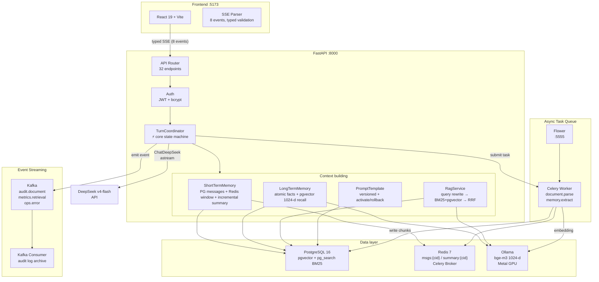

**English** | [简体中文](README.zh-CN.md)

---

# CodeAware

An AI-driven developer productivity platform designed for **software engineering lab teams** (code review, onboarding new members, team knowledge retrieval).
The current core deliverable is a **Chat/RAG knowledge-base Q&A app**: upload team documents → automatic parsing & chunking → intelligent Q&A with cited sources and chain-of-thought.


> The project was fully refactored from Java (Spring Boot + LangChain4j) to Python (FastAPI); the legacy Java implementation is kept in [java-legacy/](java-legacy/) for reference only.

---

## Core Features

| Feature | Description |
|---|---|
| 📄 **Knowledge-base Q&A** | Upload MD/DOCX/HTML/PDF → element-aware parsing → chunking & embedding → hybrid retrieval (BM25 + vector RRF) → answers **with cited sources** |
| 🧠 **Streamed chain-of-thought** | DeepSeek `reasoning_content` streamed separately from the answer (8-event typed SSE) — the model's reasoning is visible |
| 🇨🇳 **Chinese retrieval optimization** | jieba segmentation makes Chinese BM25 usable (exact Chinese R@5: 0.25 → **1.000**) |
| 🔀 **Smart routing + self-correction** | LangGraph orchestration: common-sense questions skip retrieval (saves latency); weak retrieval triggers query rewriting & retry (ADR-0015) |
| 👥 **Team-ready** | JWT auth, per-user conversation isolation, shared knowledge base & memory (lab scenario) |
| 📚 **Document management** | List / detail (chunk visualization) / soft delete / replace-update (ADR-0013) |
| 🧩 **Long-term memory** | Facts auto-extracted from conversations + pgvector recall — team context persists across sessions |

---

## Screenshots


*Chat: streaming answer + cited sources + chain-of-thought*


*Knowledge base: document list + chunk visualization + upload / replace / soft delete*


*Login: JWT team authentication*

---

## Quick Start

### Prerequisites

| Dependency | Version | Purpose |
|---|---|---|
| [Docker Desktop](https://www.docker.com/products/docker-desktop/) | any | PostgreSQL / Redis / Ollama containers |
| [uv](https://docs.astral.sh/uv/) | ≥0.4 | Python package manager |
| Node.js | ≥18 | Frontend |
| DeepSeek API key | — | LLM (`api.deepseek.com`) |

> Local dev defaults to the `deepseek-v4-flash` model (configurable); embeddings run on local Ollama bge-m3 — **zero API cost**.

### Step 1: Configure environment variables

```bash
cd codeaware-py
cp .env.example .env        # copy the template
# edit .env — at minimum:
#   LLM_API_KEY=sk-...      ← required, DeepSeek key
#   JWT_SECRET_KEY=...      ← for production, use a random string (openssl rand -hex 32)
```

### Step 2: Start base services and pull the embedding model

```bash
cd ..                       # back to repo root
docker compose up -d        # PG(:5433) + Redis(:6380) + Kafka(:9093) + Celery Worker + Flower(:5555)
# Ollama runs natively (macOS Metal GPU): brew install ollama && ollama pull bge-m3
```

### Step 3: One-command startup (migrations + admin bootstrap + backend + frontend)

```bash
bash codeaware-py/scripts/start.sh
```

The first run guides you through creating an admin account. Then visit:

```text
Frontend:  http://localhost:5173
OpenAPI:   http://localhost:8000/docs
Health:    http://localhost:8000/api/ai/health
```

### Manual startup (step by step)

```bash
docker compose up -d
(cd codeaware-py && uv sync && uv run alembic upgrade head)
(cd codeaware-py && uv run python -m scripts.create_admin)   # first time
(cd codeaware-py && uv run uvicorn app.main:app --host 127.0.0.1 --port 8000)
(cd codeaware-py/frontend && npm ci && npm run dev)
```

### Stop

```bash
bash codeaware-py/scripts/stop.sh      # stop backend + frontend, keep docker
docker compose down                    # stop everything (data persists in volumes)
```

---

## System Architecture



**Core principles**:

- **PostgreSQL is the source of truth; Redis is a disposable cache** — on Redis failure the system falls back to PG automatically, no feature degradation
- **No DB transaction is held while waiting on the model** — the connection pool is never blocked for long
- **Typed SSE with explicit semantics** — 8 event types with protocol version and strictly increasing sequence; the sync endpoint drains the same event stream — a single state machine
- **Dual runtime with rollback** — LangGraph retrieval enhancement (`RAG_RUNTIME=graph`) can be reverted to the original path (`service`) with one env change

Detailed design (Chat full-chain sequence, 9-table ER, RAG pipeline): see [docs/roadmap/current-release/README.md](docs/roadmap/current-release/README.md).

---

## Typed SSE Example (8-event protocol)

For a new conversation, `conversation_id` is created by the server and returned in `chat.started`:

```bash
curl -N http://localhost:8000/api/chat/send/stream \
  -H 'Content-Type: application/json' \
  -H 'Authorization: Bearer <token>' \
  -d '{"conversation_id":null,"message":"解释 RAG 完整链路"}'
```

The response is a stream of versioned events, not raw tokens or `[DONE]`:

```text
id: 1
event: chat.started
data: {"protocol_version":1,"conversation_id":"...","turn_id":"...","sequence":1}

id: 2
event: context.references
data: {"protocol_version":1,...,"knowledge_refs":[...],"memory_refs":[...],"sequence":2}

id: 3
event: reasoning.delta
data: {"protocol_version":1,...,"sequence":3,"delta":"首先分析..."}

id: 4
event: token.delta
data: {"protocol_version":1,...,"sequence":4,"delta":"RAG 完整链路包括..."}

event: chat.completed
data: {"protocol_version":1,...,"sequence":N}
```

---

## Tech Stack

| Layer | Choice | Notes |
|---|---|---|
| Framework | FastAPI + Pydantic v2 | async HTTP + typed SSE |
| LLM | DeepSeek v4-flash (langchain-deepseek) | ChatDeepSeek extracts reasoning_content |
| Embeddings | Ollama bge-m3 1024-d | local Metal GPU embedding, ~128ms/query, zero API cost |
| Relational DB | PostgreSQL 16 + asyncpg | PG-first source of truth |
| Vector index | pgvector HNSW cosine | inline vectors, same-transaction commit |
| Lexical search | ParadeDB pg_search BM25 | default tokenizer; pg_trgm fallback |
| Retrieval enhancement | LangGraph StateGraph (ADR-0015) | smart routing + self-correction (match_type detection) |
| Task queue | Celery + Redis | async document parsing, memory extraction, Flower monitoring |
| Event streaming | Kafka (Confluent) | audit trail, retrieval metrics, error events |
| Cache | Redis 7 | disposable, PG fallback |
| Frontend | React 19 + Vite + TypeScript | 8-module SPA (no router) |
| Tooling | uv + Alembic | locked dependencies + reversible migrations |

---

## Current Status

| Metric | Value |
|---|---|
| Backend tests | **315 passed**, 0 failed (async tasks + Kafka + LangGraph) |
| Frontend tests | **43 passed** |
| API endpoints | 32 |
| Tables | 9 |
| ADRs | 15 (0001-0015) |
| Alembic head | 0011 |
| Delivered | C1-C6 + team A/B/C + document management + async task queue + Kafka event streaming |

**Retrieval evaluation summary** (real bge-m3, 60 golden cases):

- Full evolution tracking (C3→C4→jieba→LangGraph→RAGAS): [retrieval-evolution.md](docs/optimization/retrieval-evolution.md)
- Hybrid retrieval R@5 = 0.975 ([top_k sensitivity](docs/optimization/topk-sensitivity.md))
- jieba Chinese BM25: exact Chinese R@5 0.25 → **1.000** ([ADR-0011](docs/decisions/adr/0011-jieba-chinese-bm25-segmentation.md))
- LangGraph routing accuracy **60/60 = 1.000**, retry rate 0.019 ([eval report](docs/optimization/rag-graph-eval.md))
- Generation quality RAGAS: Faithfulness 0.931 / Answer Relevancy 0.793 ([eval report](docs/optimization/ragas-eval.md))

Full evaluation data (C3/C4 lexical upgrade, per-category, sensitivity analysis): [docs/optimization/](docs/optimization/README.md).

---

## Testing

Running bare `pytest` is forbidden for the backend — a safe runner creates disposable PG/Redis instances and refuses dev databases and remote targets:

```bash
# full test suite (safe)
(cd codeaware-py && uv run python scripts/run_tests_safe.py -q)

# coverage
(cd codeaware-py && uv run python scripts/run_tests_safe.py --cov=app --cov-report=term-missing -q)

# frontend
(cd codeaware-py/frontend && npm run test && npm run lint && npm run build)
```

---

## Technology Decisions

| Decision | Chosen | Rejected after evaluation |
|---|---|---|
| LLM adapter | ChatDeepSeek (extracts reasoning) | ChatOpenAI (drops 3rd-party fields) |
| Lexical search | ParadeDB BM25 (default tokenizer) + jieba | pg_trgm (C3 noise hurt RRF) |
| PDF parsing | pdfminer.six (font-size heading detection) | unstructured.partition.pdf (pulls in torch) |
| Reranker | deferred (ADR-0009) | blind addition (MRR 0.934 already high) |
| Intent classification | not built (90% knowledge questions) | classifier risks missed retrieval |
| LangGraph | retrieval-layer routing + self-correction (ADR-0015) | full Agent tool loop (no demand) |
| Refresh token | none (7-day access) | lab doesn't need rotation |
| Concurrency guard | in-process set[str] | PG advisory lock (when multi-worker) |
| Task queue | Celery + Redis | Kafka (event stream, not task queue) |
| Ollama deployment | native macOS (Metal GPU) | Docker container (CPU-only) |

---

## Current Boundaries

| Has | Does not have |
|---|---|
| JWT auth + per-user conversation isolation | project management (X-Project-ID) |
| shared knowledge base & memory | per-user KB permissions |
| 8-event typed SSE | WebSocket |
| BM25 + pgvector RRF hybrid retrieval | two-stage reranker |
| element-aware chunking + scanned-PDF rejection | OCR |
| fail-closed disposable test stack | bare pytest |
| single-worker local-first | multi-worker / K8s |
| Celery async task queue | Agent tool loop |
| Kafka event streaming (audit/metrics) | Grafana / Loki dashboard |
| Flower task monitoring | — |
| deterministic Chat state machine | Agent tool loop |

---

## Documentation

| Doc | Purpose |
|---|---|
| [AGENTS.md](AGENTS.md) | development rules |
| [docs/roadmap/current-release/README.md](docs/roadmap/current-release/README.md) | current roadmap (C1-C6) |
| [docs/roadmap/团队化升级计划.md](docs/roadmap/团队化升级计划.md) | team upgrade design |
| [docs/roadmap/团队化升级-实施计划.md](docs/roadmap/团队化升级-实施计划.md) | team upgrade implementation |
| [docs/roadmap/部署上线指南.md](docs/roadmap/部署上线指南.md) | deployment (LAN + cloud) |
| [docs/roadmap/chat-to-agent/personal/README.md](docs/roadmap/chat-to-agent/personal/README.md) | Agent roadmap (locked) |
| [docs/optimization/](docs/optimization/README.md) | retrieval optimization evals (jieba/top_k/LangGraph/RAGAS) |
| [docs/decisions/adr/](docs/decisions/adr/) | 15 architecture decision records |
| [docs/interview/面试准备指南.md](docs/interview/面试准备指南.md) | interview deep-dive |
| [docs/interview/面试速通版.md](docs/interview/面试速通版.md) | interview speedrun |
| [docs/interview/项目简历介绍.md](docs/interview/项目简历介绍.md) | resume blurb |
| [docs/migration/Python重构迁移文档.md](docs/migration/Python重构迁移文档.md) | migration history |
