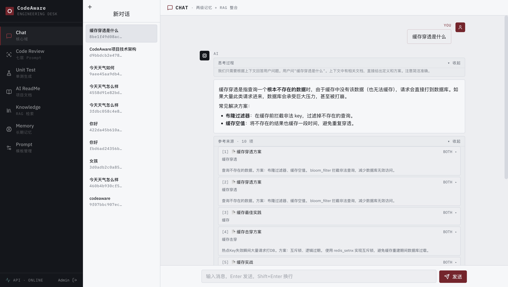
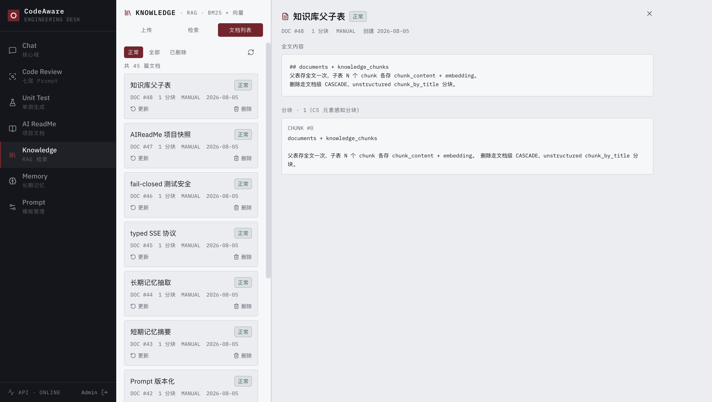
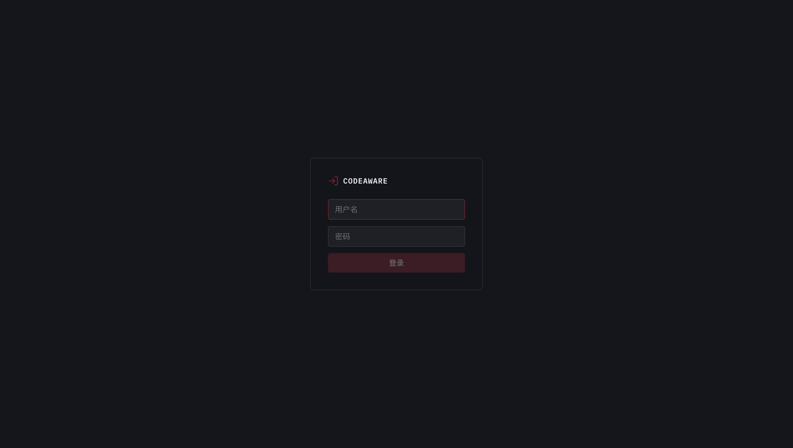
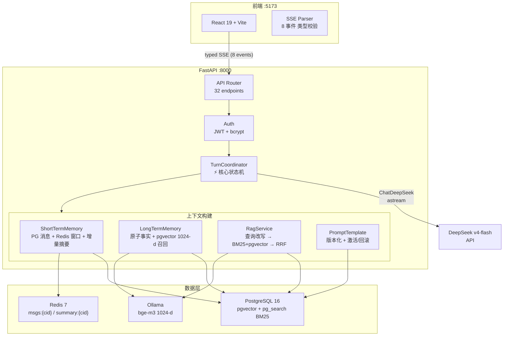

# CodeAware

AI 驱动的研发效能平台，为**软件工程实验室团队**设计（代码评审、新人培训、团队知识检索）。
当前核心交付是 **Chat/RAG 知识库问答应用**：上传团队文档 → 自动解析分块 → 带引用来源和思考过程的智能问答。


> 项目从 Java（Spring Boot + LangChain4j）全量重构为 Python（FastAPI），Java 旧实现保留在 [java-legacy/](java-legacy/) 仅供参照。

---

## 核心能力

| 能力 | 说明 |
|---|---|
| 📄 **知识库问答** | 上传 MD/DOCX/HTML/PDF → 元素感知解析 → 分块嵌入 → 混合检索（BM25 + 向量 RRF）→ 回答**带引用来源** |
| 🧠 **思考过程流式** | DeepSeek reasoning_content 与回答分离推送（8 事件 typed SSE），可见"模型如何推理" |
| 🇨🇳 **中文检索优化** | jieba 分词让中文 BM25 从不可用变可用（中文精确 R@5: 0.25 → **1.000**） |
| 🔀 **智能路由 + 自我纠错** | LangGraph 编排：常识问题跳过检索（省延迟）；检索不理想自动改写重试（ADR-0015） |
| 👥 **团队化** | JWT 登录、会话按用户隔离、知识库/记忆全员共享（实验室场景） |
| 📚 **文档管理** | 列表 / 详情（分块可视化）/ 软删除 / 替换更新（ADR-0013） |
| 🧩 **长期记忆** | 对话事实自动抽取 + pgvector 向量召回，跨会话记住团队上下文 |

---

## 界面截图



*Chat：流式回答 + 引用来源 + 思考过程*



*知识库：文档列表 + 分块可视化 + 上传/替换/软删*



*登录：JWT 团队认证*

---

## 快速开始

### 前置条件

| 依赖 | 版本 | 用途 |
|---|---|---|
| [Docker Desktop](https://www.docker.com/products/docker-desktop/) | 任意 | PostgreSQL / Redis / Ollama 容器 |
| [uv](https://docs.astral.sh/uv/) | ≥0.4 | Python 包管理 |
| Node.js | ≥18 | 前端 |
| DeepSeek API key | — | LLM（`api.deepseek.com`） |

> 本地开发默认使用 `deepseek-v4-flash` 模型（可改）；embedding 走本地 Ollama bge-m3，**零 API 费**。

### 第 1 步：配置环境变量

```bash
cd codeaware-py
cp .env.example .env        # 复制模板
# 编辑 .env，至少修改：
#   LLM_API_KEY=sk-...      ← 必填，DeepSeek key
#   JWT_SECRET_KEY=...      ← 生产部署建议换随机串（openssl rand -hex 32）
```

### 第 2 步：启动基础服务并拉取嵌入模型

```bash
cd ..                       # 回到仓库根
docker compose up -d        # PG(:5433) + Redis(:6380) + Ollama(:11434)
docker exec ai-center-ollama ollama pull bge-m3   # 首次需拉取嵌入模型
```

### 第 3 步：一键启动（迁移 + admin 引导 + 后端 + 前端）

```bash
bash codeaware-py/scripts/start.sh
```

首次运行会引导创建 admin 账号。启动后访问：

```text
前端:     http://localhost:5173
OpenAPI:  http://localhost:8000/docs
健康检查: http://localhost:8000/api/ai/health
```

### 手动启动（分步）

```bash
docker compose up -d
(cd codeaware-py && uv sync && uv run alembic upgrade head)
(cd codeaware-py && uv run python -m scripts.create_admin)   # 首次
(cd codeaware-py && uv run uvicorn app.main:app --host 127.0.0.1 --port 8000)
(cd codeaware-py/frontend && npm ci && npm run dev)
```

### 停止

```bash
bash codeaware-py/scripts/stop.sh      # 停后端+前端, docker 保留
docker compose down                    # 全停（数据在 volume 中保留）
```

---

## 系统架构



**核心原则**：

- **PG 是真相源，Redis 只做可丢弃缓存**——Redis 挂掉自动回查 PG，功能不降级
- **模型等待期间不持有数据库事务**——连接池不被长时间占用
- **typed SSE 显式语义**——生成/降级/完成 8 种事件带版本号和严格递增序号，同步接口 drain 同一事件流，状态机只有一份
- **双运行时可回退**——LangGraph 检索增强（`RAG_RUNTIME=graph`）异常可一键回退原路径（`service`）

详细设计：Chat 全链路时序、数据模型（9 表 ER）、RAG 流水线见 [docs/roadmap/current-release/README.md](docs/roadmap/current-release/README.md)。

---

## typed SSE 示例（8 事件协议）

新会话的 `conversation_id` 由服务端创建并在 `chat.started` 中返回：

```bash
curl -N http://localhost:8000/api/chat/send/stream \
  -H 'Content-Type: application/json' \
  -H 'Authorization: Bearer <token>' \
  -d '{"conversation_id":null,"message":"解释 RAG 完整链路"}'
```

响应是版本化事件，不是裸 token 或 `[DONE]`：

```text
id: 1
event: chat.started
data: {"protocol_version":1,"conversation_id":"...","turn_id":"...","sequence":1}

id: 2
event: context.references
data: {"protocol_version":1,...,"knowledge_refs":[...],"memory_refs":[...],"sequence":2}

id: 3
event: reasoning.delta
data: {"protocol_version":1,...,"sequence":3,"delta":"首先分析..."}

id: 4
event: token.delta
data: {"protocol_version":1,...,"sequence":4,"delta":"RAG 完整链路包括..."}

event: chat.completed
data: {"protocol_version":1,...,"sequence":N}
```

---

## 技术栈

| 层 | 选型 | 备注 |
|---|---|---|
| 框架 | FastAPI + Pydantic v2 | async HTTP + typed SSE |
| LLM | DeepSeek v4-flash (langchain-deepseek) | ChatDeepSeek 提取 reasoning_content |
| 向量 | Ollama bge-m3 1024-d | 本地 CPU embedding, 零 API 费 |
| 关系 DB | PostgreSQL 16 + asyncpg | PG-first 真相源 |
| 向量索引 | pgvector HNSW cosine | 内联向量, 同事务 commit |
| 词法检索 | ParadeDB pg_search BM25 | default tokenizer; pg_trgm 回退 |
| 检索增强 | LangGraph StateGraph（ADR-0015） | 智能路由 + 自我纠错（match_type 检测） |
| 缓存 | Redis 7 | 可丢弃, PG fallback |
| 前端 | React 19 + Vite + TypeScript | 8 模块 SPA（无 router） |
| 包管理 | uv + Alembic | 依赖锁定 + 迁移回退 |

---

## 当前状态

| 指标 | 数值 |
|---|---|
| 后端测试 | **315 passed**, 0 failed |
| 前端测试 | **43 passed** |
| API 端点 | 32 个 |
| 数据表 | 9 张 |
| ADR | 15 篇 (0001-0015) |
| Alembic head | 0011 |
| 完成阶段 | C1-C6 + 团队化 A/B/C + 文档管理 |

**检索评估摘要**（真实 bge-m3，35 条 golden）：

- 混合检索 R@5 = 0.986（[top_k 敏感性](docs/optimization/topk-sensitivity.md)）
- jieba 中文 BM25：中文精确 R@5 0.25 → **1.000**（[ADR-0011](docs/decisions/adr/0011-jieba-chinese-bm25-segmentation.md)）
- LangGraph 路由准确率 **35/35 = 1.000**，重试触发率 0.0（命中不重试）（[评估报告](docs/optimization/rag-graph-eval.md)）
- 生成质量 RAGAS：Faithfulness 0.939 / Answer Relevancy 0.812（[评估报告](docs/optimization/ragas-eval.md)）

完整评测数据（C3/C4 词法升级、按类别、敏感性分析）见 [docs/optimization/](docs/optimization/README.md)。

---

## 测试

后端测试禁止裸跑 `pytest`——安全执行器创建随机 disposable PG/Redis，拒绝开发库和远程目标：

```bash
# 全量测试（安全）
(cd codeaware-py && uv run python scripts/run_tests_safe.py -q)

# 覆盖率
(cd codeaware-py && uv run python scripts/run_tests_safe.py --cov=app --cov-report=term-missing -q)

# 前端
(cd codeaware-py/frontend && npm run test && npm run lint && npm run build)
```

---

## 技术决策一览

| 决策 | 选了 | 评估后没选 |
|---|---|---|
| LLM adapter | ChatDeepSeek（提取 reasoning） | ChatOpenAI（丢弃第三方字段） |
| 词法检索 | ParadeDB BM25 (default tokenizer) + jieba 中文分词 | pg_trgm（C3 噪声拖累 RRF） |
| PDF 解析 | pdfminer.six（字号标题检测） | unstructured.partition.pdf（拖 torch） |
| Reranker | 评估后暂缓 (ADR-0009) | 盲目加（MRR 0.934 已高） |
| 意图识别 | 不做（90% 知识问题） | 加分类引入漏检风险 |
| LangGraph | 检索层智能路由 + 自我纠错（ADR-0015） | 完整 Agent 工具循环（无需求触发） |
| Refresh token | 不要（access 7 天） | 实验室不需要 refresh 轮换 |
| 并发 guard | 进程内 set[str] | PG advisory lock（多 worker 时再做） |

---

## 当前边界

| 有 | 没有 |
|---|---|
| JWT 认证 + 会话按用户隔离 | 项目管理（X-Project-ID） |
| 知识库/记忆全员共享 | 知识库按人权限 |
| 8 事件 typed SSE | WebSocket |
| BM25 + pgvector RRF 混合检索 | Reranker 二阶段精排 |
| 元素感知分块 + 扫描 PDF 拒绝 | OCR |
| fail-closed disposable 测试栈 | 裸 pytest |
| 单 worker local-first | 多 worker / K8s |
| 确定性 Chat 状态机 | Agent 工具循环 |

---

## 文档入口

| 文档 | 用途 |
|---|---|
| [AGENTS.md](AGENTS.md) | 开发规则 |
| [docs/roadmap/current-release/README.md](docs/roadmap/current-release/README.md) | 当前路线 (C1-C6) |
| [docs/roadmap/团队化升级计划.md](docs/roadmap/团队化升级计划.md) | 团队化设计 |
| [docs/roadmap/团队化升级-实施计划.md](docs/roadmap/团队化升级-实施计划.md) | 团队化落地 |
| [docs/roadmap/部署上线指南.md](docs/roadmap/部署上线指南.md) | 部署 (局域网 + 云) |
| [docs/roadmap/chat-to-agent/personal/README.md](docs/roadmap/chat-to-agent/personal/README.md) | Agent 路线（锁定） |
| [docs/optimization/](docs/optimization/README.md) | 检索优化评估（jieba/top_k/LangGraph/RAGAS） |
| [docs/decisions/adr/](docs/decisions/adr/) | 15 篇架构决策 |
| [docs/interview/面试准备指南.md](docs/interview/面试准备指南.md) | 面试深挖 |
| [docs/interview/面试速通版.md](docs/interview/面试速通版.md) | 面试速通 |
| [docs/interview/项目简历介绍.md](docs/interview/项目简历介绍.md) | 简历粘贴 |
| [docs/migration/Python重构迁移文档.md](docs/migration/Python重构迁移文档.md) | 迁移历史 |
