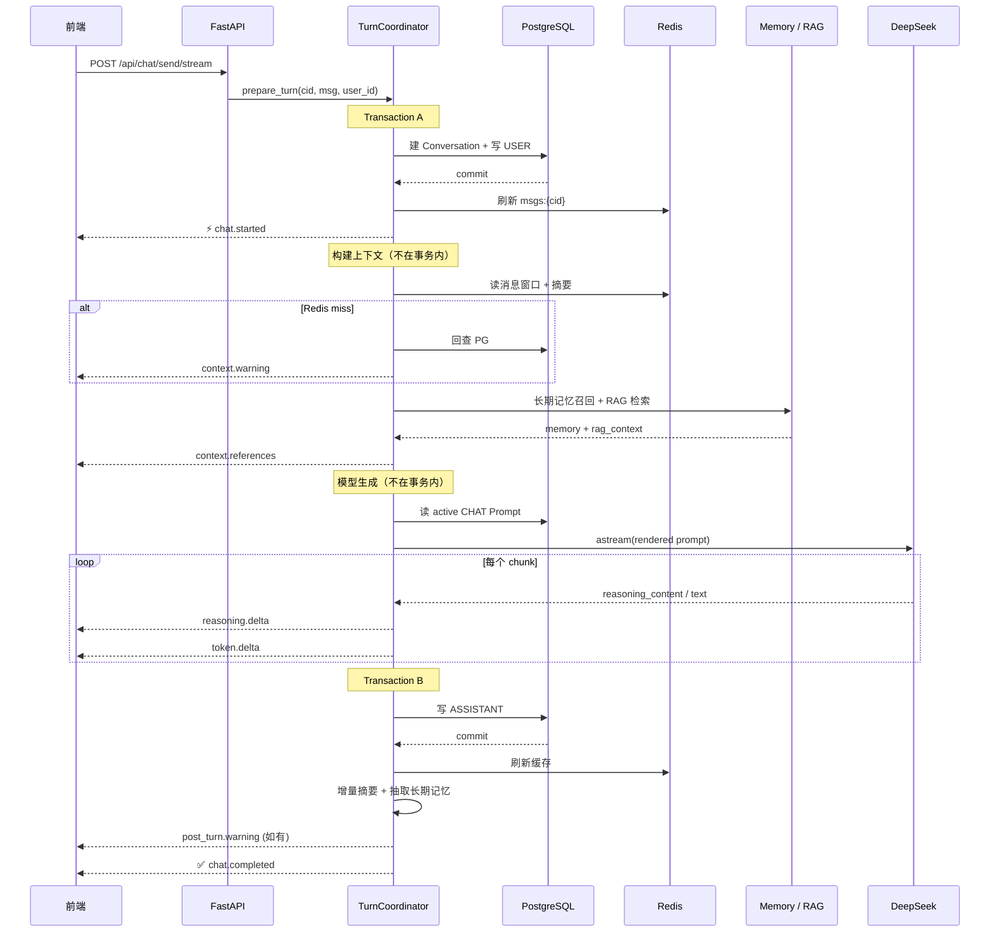
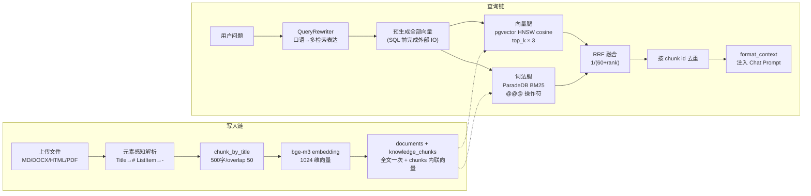
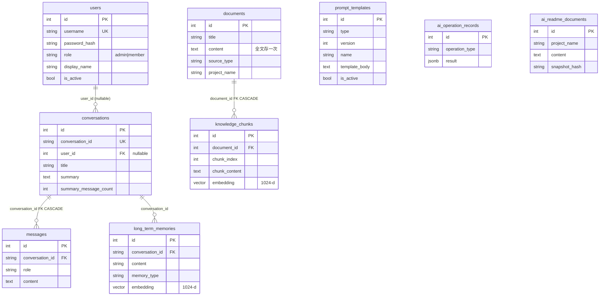
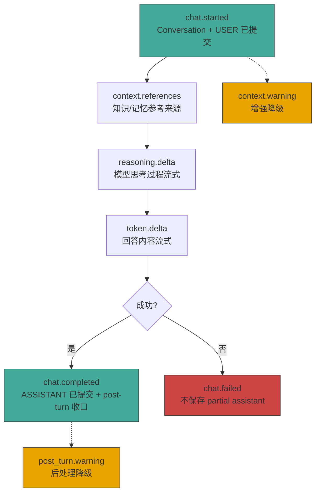
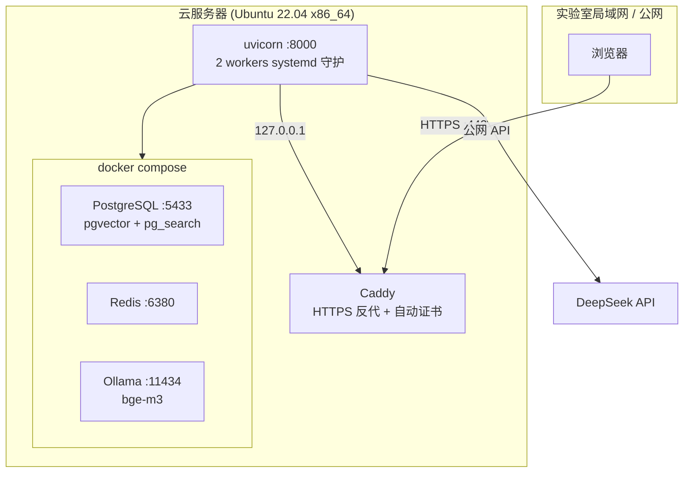

# CodeAware

AI 驱动的研发效能平台，为**软件工程实验室团队**设计（代码评审、新人培训、团队知识检索）。
从 Java（Spring Boot + LangChain4j）全量重构为 Python，以 **Chat 为核心域**。

> 当前是 **Chat/RAG 应用**（不是 Agent），含 JWT 认证 + 会话隔离的团队化升级已完成。
> Agent 路线文档已就绪，保持锁定待授权。

---

## 系统架构


**核心原则**：PG 是真相源 → Redis 只做可丢弃缓存 → typed SSE 把生成/降级/完成语义显式交给前端。

---

## Chat 一条请求全链路



**关键设计**：模型等待期间不持有数据库事务 → 连接池不被长时间占用。

---

## 知识库 RAG 流水线



**PDF 分支**：pypdf 文本层探针 → 有文本层：pdfminer 字号标题检测；无文本层：显式拒绝 `KNOWLEDGE_PDF_NO_TEXT_LAYER`（不引 OCR）。

---

## 数据模型



**核心关系**：会话归属用户（user_id nullable 兼容直连测试）；知识库/记忆**不加 user_id**——全员共享（实验室场景）。

---

## Typed SSE 协议（8 事件）



每个事件带 `protocol_version=1` + `sequence`（严格递增）+ `turn_id`。同步接口 drain 同一事件流——核心状态机只有一份。

---

## 部署架构（实验室云服务器）



| 方案 | 适用 | 启动方式 |
|---|---|---|
| 本地开发 | 单机 | `bash codeaware-py/scripts/start.sh` |
| 云部署 | 团队 | `sudo bash codeaware-py/scripts/deploy.sh bootstrap` |

---

## 技术栈

| 层 | 选型 | 备注 |
|---|---|---|
| 框架 | FastAPI + Pydantic v2 | async HTTP + typed SSE |
| LLM | DeepSeek v4-flash (langchain-deepseek) | ChatDeepSeek 提取 reasoning_content |
| 向量 | Ollama bge-m3 1024-d | 本地 CPU embedding, 零 API 费 |
| 关系 DB | PostgreSQL 16 + asyncpg | PG-first 真相源 |
| 向量索引 | pgvector HNSW cosine | 内联向量, 同事务 commit |
| 词法检索 | ParadeDB pg_search BM25 | default tokenizer; pg_trgm 回退 |
| 缓存 | Redis 7 | 可丢弃, PG fallback |
| 前端 | React 19 + Vite + TypeScript | 7 模块 SPA（无 router） |
| 包管理 | uv + Alembic | 依赖锁定 + 迁移回退 |

---

## 当前状态

| 指标 | 数值 |
|---|---|
| 后端测试 | **301 passed**, 0 failed |
| 前端测试 | **39 passed** |
| API 端点 | 25 个 |
| 数据表 | 9 张 |
| ADR | 10 篇 (0001-0010) |
| Alembic head | 0008 |
| 完成阶段 | C1-C6 + 团队化 A/B/C |

**最新交付**：C6 Chat 引用+思考（8 事件 typed SSE）、团队化升级（JWT 认证 + 会话隔离 + 前端登录）。

详见 [当前版本路线](docs/roadmap/current-release/README.md) 和 [团队化升级计划](docs/roadmap/团队化升级计划.md)。

---

## 快速启动

### 本地开发

```bash
# 一键启动（docker + 迁移 + admin 引导 + 后端 + 前端）
bash codeaware-py/scripts/start.sh

# 首次启动会引导创建 admin 账号，之后访问:
#   前端: http://localhost:5173
#   OpenAPI: http://localhost:8000/docs
#   健康: http://localhost:8000/api/ai/health
```

### 停止

```bash
bash codeaware-py/scripts/stop.sh                    # 停止后端+前端, docker 保留
cd /path/to/ai-center && docker compose down          # 全停（含数据服务）
```

### 手动启动（分步）

```bash
docker compose up -d
(cd codeaware-py && uv sync && uv run alembic upgrade head)
(cd codeaware-py && uv run python -m scripts.create_admin)  # 首次
(cd codeaware-py && uv run uvicorn app.main:app --host 127.0.0.1 --port 8000)
(cd codeaware-py/frontend && npm ci && npm run dev)
```

---

## typed SSE 示例

新会话的 `conversation_id` 由服务端创建并在 `chat.started` 中返回：

```bash
curl -N http://localhost:8000/api/chat/send/stream \
  -H 'Content-Type: application/json' \
  -H 'Authorization: Bearer <token>' \
  -d '{"conversation_id":null,"message":"解释 RAG 完整链路"}'
```

响应是版本化事件，不是裸 token 或 `[DONE]`：

```text
id: 1
event: chat.started
data: {"protocol_version":1,"conversation_id":"...","turn_id":"...","sequence":1}

id: 2
event: context.references
data: {"protocol_version":1,...,"knowledge_refs":[...],"memory_refs":[...],"sequence":2}

id: 3
event: reasoning.delta
data: {"protocol_version":1,...,"sequence":3,"delta":"首先分析..."}

id: 4
event: token.delta
data: {"protocol_version":1,...,"sequence":4,"delta":"RAG 完整链路包括..."}

event: chat.completed
data: {"protocol_version":1,...,"sequence":N}
```

---

## 检索评估数据

**评测集**：15 篇 fixture 文档（技术方案 + 代码标识符 + 多语言），35 条 golden cases（中文精确 ×8、英文自然 ×7、稀有标识符 ×8、语义改写 ×7、负例 ×5），真实 bge-m3 embedding。

> ⚠️ C4 基线评测使用 `chinese_compatible` tokenizer，但生产迁移 0006 使用 `default`——已公布的 C4 数据不完全反映生产行为。jieba 优化（ADR-0011）修正了这一不一致。

### 词法腿升级：C3 (pg_trgm) → C4 (BM25) → C4+ jieba

| 指标 | C3 pg_trgm | C4 BM25 (default) | C4+ jieba |
|---|---|---|---|
| 词法腿 R@5 | 0.543 | 0.600 | **0.943** |
| 词法腿 MRR@10 | 0.529 | 0.571 | **0.852** |
| 中文精确 R@5 | 0.000 | 0.250 | **1.000** |
| 中文精确 MRR | 0.000 | 0.250 | **0.854** |
| 语义改写 R@5 | 0.000 | 0.000 | **0.857** |
| 稀有标识符 MRR | 0.938 | 0.938 | **1.000** |

> **关键**：jieba 分词（ADR-0011）让 BM25 腿中文从"基本残废"变"几乎满分"。
> `default` tokenizer 不拆连续中文——文档侧靠 `##` 标题分隔还能部分匹配，但**查询侧**"缓存击穿如何解决"是一个 token，匹配不到文档的"缓存击穿"。jieba 把查询切词（`缓存 击穿 如何 解决`），BM25 腿中文查询第一次真正可用。

### 三路对照（当前生产）

| 路径 | R@5 | MRR@10 | 说明 |
|---|---|---|---|
| BM25 only (jieba) | 0.943 | 0.852 | jieba 分词后 default tokenizer |
| vector only | 0.957 | 0.920 | pgvector HNSW cosine 语义召回 |
| **fused (jieba BM25 + vector)** | — | **>0.934** | RRF 融合 — 生产 |

### 按类别（jieba BM25）

| 类别 | n | R@5 | MRR@10 | 说明 |
|---|---|---|---|---|
| chinese_exact | 8 | **1.000** | 0.854 | jieba 查询切词后全命中 |
| english_natural | 7 | 0.857 | 0.786 | 不受影响 |
| rare_identifier | 8 | 1.000 | **1.000** | 纯英文标识符原样通过 |
| semantic_paraphrase | 7 | **0.857** | 0.643 | 意外收获：切词后词面匹配同义词 |
| negative | 5 | 1.000 | 1.000 | 不相关查询仍返回空 |

### top_k 敏感性（ADR-0012）

检索层 `top_k=5` 经 35 条 golden 敏感性分析验证（[详情](docs/optimization/topk-sensitivity.md)）：

| top_k | R@5 | MRR@10 | est token |
|---|---|---|---|
| 3 | 0.986 | 0.938 | 900 |
| **5（当前）** | **0.986** | **0.938** | 1500 |
| 8 | 0.986 | 0.938 | 2400 |
| 15 | 0.986 | 0.952 | 4500 |

**结论**：R@5 在 k=3 已饱和，MRR 无单调提升，token 成本线性增长——**保持 5**，k=8+ 是纯浪费。生产代码不改。

### 已知边界

- 中文精确 MRR=0.854（非满分）：部分中文查询切词后 MRR 受 BM25 排名影响，fused 模式由向量腿补充
- 语义改写 R@5 从 0.786（向量）→ BM25 也到 0.857：jieba 切词让词面腿也参与同义召回
- 无 cross-encoder reranker（评估后暂缓，ADR-0009，门禁 MRR+0.01）
- BM25 中文优化通过 jieba 应用层分词（ADR-0011），非 ParadeDB 级 tokenizer 替换
- 评测集 35 条，非百万级——足以验证架构决策，不足以做统计显著性

评测脚本：`tests/eval/test_golden_retrieval.py`，原始数据：`tests/eval/artifacts/baseline_c4_bm25.json`

---

## 安全测试

后端测试禁止裸跑 `pytest`。安全执行器创建随机 disposable PG/Redis，拒绝开发库和远程目标：

```bash
# 全量测试（安全）
(cd codeaware-py && uv run python scripts/run_tests_safe.py -q)

# 覆盖率
(cd codeaware-py && uv run python scripts/run_tests_safe.py --cov=app --cov-report=term-missing -q)

# 前端
(cd codeaware-py/frontend && npm run test && npm run lint && npm run build)
```

---

## 技术决策一览

| 决策 | 选了 | 评估后没选 |
|---|---|---|
| LLM adapter | ChatDeepSeek（提取 reasoning） | ChatOpenAI（丢弃第三方字段） |
| 词法检索 | ParadeDB BM25 (default tokenizer) + jieba 中文分词 | pg_trgm（C3 噪声拖累 RRF） |
| PDF 解析 | pdfminer.six（字号标题检测） | unstructured.partition.pdf（拖 torch） |
| Reranker | 评估后暂缓 (ADR-0009) | 盲目加（MRR 0.934 已高） |
| 意图识别 | 不做（90% 知识问题） | 加分类引入漏检风险 |
| LangGraph / Agent | 不做（无模型自主选工具需求） | 等真实需求触发 |
| Refresh token | 不要（access 7 天） | 实验室不需要 refresh 轮换 |
| 并发 guard | 进程内 set[str] | PG advisory lock（多 worker 时再做） |

---

## 当前边界

| 有 | 没有 |
|---|---|
| JWT 认证 + 会话按用户隔离 | 项目管理（X-Project-ID） |
| 知识库/记忆全员共享 | 知识库按人权限 |
| 8 事件 typed SSE | WebSocket |
| BM25 + pgvector RRF 混合检索 | Reranker 二阶段精排 |
| 元素感知分块 + 扫描 PDF 拒绝 | OCR |
| fail-closed disposable 测试栈 | 裸 pytest |
| 单 worker local-first | 多 worker / K8s |
| 确定性 Chat 状态机 | Agent 工具循环 |

---

## 文档入口

| 文档 | 用途 |
|---|---|
| [AGENTS.md](AGENTS.md) | 开发规则 |
| [docs/roadmap/current-release/README.md](docs/roadmap/current-release/README.md) | 当前路线 (C1-C6) |
| [docs/roadmap/团队化升级计划.md](docs/roadmap/团队化升级计划.md) | 团队化设计 |
| [docs/roadmap/团队化升级-实施计划.md](docs/roadmap/团队化升级-实施计划.md) | 团队化落地 |
| [docs/roadmap/部署上线指南.md](docs/roadmap/部署上线指南.md) | 部署 (局域网 + 云) |
| [docs/roadmap/chat-to-agent/personal/README.md](docs/roadmap/chat-to-agent/personal/README.md) | Agent 路线（锁定） |
| [docs/decisions/adr/](docs/decisions/adr/) | 10 篇架构决策 |
| [docs/interview/面试准备指南.md](docs/interview/面试准备指南.md) | 面试深挖 |
| [docs/interview/面试速通版.md](docs/interview/面试速通版.md) | 面试速通 |
| [docs/interview/项目简历介绍.md](docs/interview/项目简历介绍.md) | 简历粘贴 |
| [docs/migration/Python重构迁移文档.md](docs/migration/Python重构迁移文档.md) | 迁移历史 |
