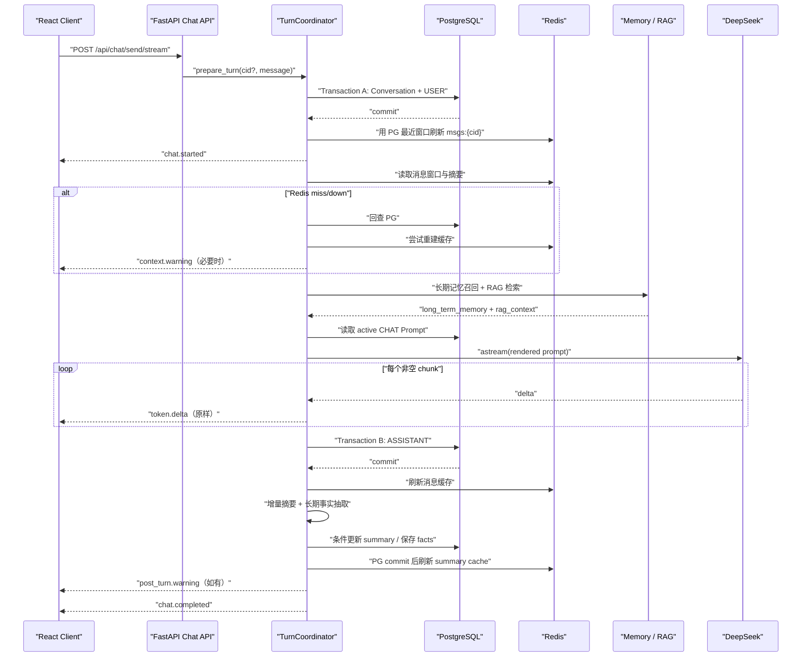

# CodeAware 项目面试准备指南

> 本文只讲当前 Python 实现已经交付并有测试证据的能力。Java 模块仅作为迁移背景，
> 不能再用来描述当前运行时。
>
> 当前版本仍是 **Chat/RAG 应用**，不是 Agent。C1 已完成，证据见
> [C1 验收报告](../roadmap/current-release/evidence/C1/report.md)。

---

## 一、先记住项目主线

CodeAware 是一个 AI 驱动的研发效能平台，提供 Code Review、单测生成、AIReadMe、
Chat、Knowledge、Memory 和 Prompt 等能力。

最初的项目定位是“把 AI 能力接入研发流程，降低 Code Review、单测编写和项目知识
传递的成本”。这个定位仍然成立，但面试时要把“业务愿景”和“当前已实现能力”分开：

| 最初定位 | 当前已经实现 | 面试边界 |
|---|---|---|
| AI 研发流程管理 | CR、Unit Test、AIReadMe、Chat 等独立 API/UI 与持久化记录 | 尚未实现 GitLab CI 自动触发，不说已接入企业流水线 |
| 结构化 AI Code Review | 角色、维度、等级、模板和结构化输出 | AI 是语义补充，不替代 Sonar 或人工审批 |
| AI 友好型项目 | AIReadMe 读取 allowlist 内真实快照，记录 hash/version | 当前不自动把生成文件写回源仓库 |
| 团队智能问答知识库 | Chat + 两级记忆 + Knowledge RAG | 当前是本地单用户/单 worker |
| 短期记忆 | PG 完整消息 + Redis 最近窗口 + PG/Redis 摘要 | 不再描述为“Redis 保存后异步落 PG” |
| 长期记忆 | 主动抽取原子事实 + bge-m3 + pgvector cosine 召回 | 当前没有复杂记忆治理或用户画像系统 |
| RAG 召回 | 查询改写 + 结构分块 + pg_trgm/pgvector + RRF | 当前不是 BM25，也没有 reranker |

原始项目描述中的“线上缺陷率下降 60%”“效率提升 80%”属于目标性表达。除非能够给出
样本量、对照组、统计周期和计算方式，否则面试时不要作为已经被项目证明的指标。当前更
可靠的量化证据是自动测试、覆盖率、完整请求链、故障注入和可重复演示。

面试时不要平均介绍所有页面。项目最值得讲的主线是：

```text
以 Chat 为核心域
→ 短期记忆、长期记忆和 RAG 都在一条问答链路中汇合
→ Prompt 是版本化资产
→ PostgreSQL 保存业务真相
→ Redis 只做可丢弃缓存
→ typed SSE 把生成、降级和完成语义显式交给前端
```

Code Review、Unit Test、AIReadMe 是复用 Prompt、结构化输出和持久化基建的薄工具；
Chat 才体现系统的状态、事务、检索、流式传输和故障处理深度。

### 30 秒电梯演讲

> 「我做了一个 FastAPI + LangChain + PostgreSQL/pgvector + Redis 的 AI 研发效能
> 平台，核心域是带两级记忆和 RAG 的 Chat。这个项目不只是把问题发给模型：一条请求
> 会先提交用户消息，再并入历史摘要、最近消息、长期记忆和知识库检索结果，通过数据库
> 中的版本化 Prompt 调用 DeepSeek，并用 typed SSE 流式返回。消息和摘要以 PostgreSQL
> 为真相，Redis 只做提交后的缓存；Redis、RAG 或记忆降级会变成可观察 warning，不会
> 伪装成成功或破坏核心消息。知识库检索采用 pgvector 语义召回与 pg_trgm 关键词召回，
> 再用 RRF 融合。我还为断线取消、同会话并发、摘要水位线、空环境启动和破坏性测试隔离
> 做了完整闭环。」

### 2 分钟展开版

> 「我先把 Chat 拆成一条明确的单轮状态机，而不是把数据库、Redis、模型和后处理全塞进
> 一个 service 方法。`TurnCoordinator` 同时服务同步和流式接口：Transaction A 创建
> 会话并提交 USER；提交后才刷新 Redis，然后发 `chat.started`。接着读取摘要和最近
> 消息，召回长期记忆，执行 RAG，把四类上下文渲染进 active CHAT Prompt。模型输出通过
> `token.delta` 原样传给前端，完成后 Transaction B 提交 ASSISTANT，再执行消息缓存
> 刷新、增量摘要和长期记忆抽取，最后才发 `chat.completed`。
>
> 这里最关键的设计是边界清楚：模型和 embedding 这类外部网络等待期间不占用数据库
> transaction；PG 是真相源，Redis miss 会回查 PG 并重建缓存；非核心增强失败发
> `context.warning` 或 `post_turn.warning`，模型或消息持久化失败才发 `chat.failed`。
> 客户端断开时关闭上游模型流，保留已经提交的 USER，不保存 partial assistant，并释放
> 同会话 guard。
>
> RAG 也分成写入链和查询链。写入时 Document 只保存一份全文，KnowledgeChunk 保存
> 结构化分块和内联 1024 维向量。查询时先改写成多个检索表达并预生成向量，再在短数据库
> session 中分别跑 pgvector cosine 和 pg_trgm similarity，每条腿取候选，用
> `1/(60+rank)` 做 RRF，标记结果来自 vector、keyword 或 both，最后按 chunk id 去重
> 后注入 Chat。当前没有 cross-encoder reranker，我会明确把 RRF 称为融合，不会把未实现
> 的 rerank 讲成已有能力。」

---

## 二、当前技术架构

```text
React + Vite
    │
    │ HTTP / typed SSE
    ▼
FastAPI Router
    │
    ├── TurnCoordinator ── Chat 单轮状态机
    │      ├── ShortTermMemoryManager
    │      ├── LongTermMemoryManager
    │      ├── RagService
    │      └── PromptTemplateManager
    │
    ├── CodeReview / UnitTest / AIReadMe
    └── Knowledge / Memory / Prompt API

PostgreSQL 16 + pgvector
    ├── Conversation / Message / Prompt / Record
    ├── LongTermMemory Vector(1024)
    └── Document / KnowledgeChunk Vector(1024)

Redis 7                    Ollama
    ├── msgs:{cid}             └── bge-m3 1024-d embedding
    └── summary:{cid}

DeepSeek OpenAI-compatible API
    └── Chat / 摘要 / 查询改写 / 事实抽取 / 结构化生成
```

### 为什么选择这套栈

| 技术 | 当前用途 | 选择理由 |
|---|---|---|
| FastAPI | async HTTP、SSE、OpenAPI | 与异步 LLM/Redis/数据库链路契合，契约可直接验证 |
| LangChain | DeepSeek/Ollama adapter | 统一模型调用和结构化输出，不把领域逻辑绑死在 SDK 上 |
| SQLAlchemy 2 async | 事务和 ORM | 明确控制短 transaction，适合 PG-first 设计 |
| PostgreSQL + pgvector | 关系数据、向量、关键词检索 | 单库完成业务真相、cosine 和 pg_trgm，个人项目复杂度可控 |
| Redis async | 短期消息和摘要缓存 | 低延迟且可丢弃；失效后可由 PG 重建 |
| Ollama bge-m3 | 本地 embedding | 1024 维、多语言、本地可运行，不消耗远程 embedding 费用 |
| Alembic + uv | 迁移和依赖 | 数据结构可回退，依赖锁可复现 |

不要再回答“换 Pinecone 只改一行配置”或“连接失败自动切换”。当前实现统一了
`VectorRecallService`，但实际存储就是 PostgreSQL/pgvector；迁移到其他向量库仍需要
实现、数据迁移和重新验收。

---

## 三、Chat 核心设计

### 3.1 设计目标

Chat 不是单次 `LLM.invoke()`。当前设计同时解决六个问题：

1. 新会话必须尽早拿到真实 `conversation_id`。
2. 流式 token 的前导空格、换行和 Markdown 不能丢。
3. USER、ASSISTANT、摘要和缓存的成功语义必须真实。
4. Redis、Memory、RAG 等增强能力故障时，核心 Chat 可以降级完成。
5. 模型失败、客户端断线和同会话并发不能制造脏数据。
6. 外部模型等待不能长期占用数据库 transaction。

### 3.2 关键对象的职责

| 对象 | 职责 | 不负责什么 |
|---|---|---|
| `chat.py` Router | HTTP 校验、前置错误、SSE 格式化 | 不复制业务状态机 |
| `TurnCoordinator` | 单轮编排、事务顺序、事件、warning、guard | 不是 AgentRun 或 Tool loop |
| `ShortTermMemoryManager` | 消息窗口、摘要读取/写入、PG/Redis fallback | 不决定 HTTP 终态 |
| `LongTermMemoryManager` | 原子事实抽取、内联向量、语义召回 | 不存外部 Knowledge |
| `RagService` | 查询改写、混合检索、去重和上下文格式化 | 不直接生成最终回答 |
| `PromptTemplateManager` | 获取 active CHAT 模板并渲染占位符 | 不硬编码 Chat system prompt |

同步接口 `POST /api/chat/send` 和流式接口
`POST /api/chat/send/stream` 共用同一个 `TurnCoordinator`。同步接口只是 drain 同一事件流
并组合最终结果，因此两条入口不会各自演化出不同的事务或错误语义。

### 3.3 一条询问请求的完整链路



按代码时序可以拆成 11 步：

1. Router 校验请求；已有 `conversation_id` 时先确认会话存在。
2. 获取 per-conversation turn guard；相同 cid 已在生成则返回稳定 409。
3. Transaction A 创建 Conversation（新会话）并写 USER，显式 commit。
4. 从 PG 最近窗口重建 Redis 消息缓存；失败只记录 warning。
5. 发出首事件 `chat.started`。此时 cid 和 USER 已可从 PG 查询。
6. 构建上下文：摘要 + 最近消息 + 长期记忆 + RAG；排除刚保存的当前 USER。
7. 从数据库加载 active CHAT Prompt，渲染四个占位符。
8. 调用 `ChatOpenAI.astream()`，每个非空 chunk 原样发送 `token.delta`。
9. Transaction B 保存完整 ASSISTANT 并 commit；partial assistant 永不落库。
10. post-turn 刷新消息缓存、增量摘要并抽取长期事实。
11. 所有 post-turn 要么成功、要么转成 warning 后，才发 `chat.completed` 并释放 guard。

### 3.4 Prompt 为什么不会重复当前问题

CHAT 模板使用四个占位符：

```text
{{long_term_memory}}
{{rag_context}}
{{conversation_history}}
{{user_message}}
```

Transaction A 已经把当前 USER 保存到了消息表。构建 history 时，如果窗口最后一条正是
本轮 USER，会先移除，再把当前问题只通过 `user_message` 注入。这样既能做到
`chat.started` 前消息已提交，又不会在最终 Prompt 中把问题重复两次。

### 3.5 Typed SSE 协议

每个事件都有：

```text
protocol_version = 1
conversation_id
turn_id
sequence
```

SSE 的 `id` 等于 `sequence`，从 1 严格递增。

| 事件 | 含义 |
|---|---|
| `chat.started` | 首事件；Conversation 与 USER 已提交 |
| `context.warning` | Redis 读取、Memory 或 RAG 降级，但仍可继续生成 |
| `token.delta` | 模型原始非空 chunk，不 trim |
| `post_turn.warning` | ASSISTANT 已提交，摘要、抽取或缓存刷新降级 |
| `chat.completed` | ASSISTANT 已提交，post-turn 已完成或转 warning |
| `chat.failed` | context/model/persist 等核心阶段失败；不保存 partial assistant |

为什么不用裸 `data: token` + `[DONE]`：

- 裸 token 无法告诉前端新会话 cid。
- `[DONE]` 不能证明数据库和后处理已经完成。
- 无法区分“核心失败”和“增强能力降级”。
- 结构化事件可以做版本校验、顺序校验和前端状态机。

### 3.6 PG-first 与 Redis-cache

当前一致性原则是：

```text
PostgreSQL commit
→ Redis refresh
```

而不是：

```text
先写 Redis
→ 再等请求结束时提交 PG
```

原因：

- 如果 Redis 先成功而 PG 回滚，会出现数据库里不存在的“幽灵消息”。
- 如果 Redis 故障阻止 PG 写入，缓存反而成了核心链路单点。
- PG 更适合承担历史、约束、迁移和审计；Redis 适合作为可重建窗口。

消息缓存使用 `msgs:{cid}`，保留最近 **20 条消息**，TTL 7 天；摘要缓存使用
`summary:{cid}`。Redis miss 或读取失败时：

1. 从 PG 查询最近消息或 `conversations.summary`；
2. 正常使用 PG 结果继续 Chat；
3. 再尝试精确替换 Redis 缓存；
4. 回填失败则发 warning。

精确替换而不是盲目 append，可以避免 Redis 曾有脏数据时产生重复窗口。

### 3.7 为什么模型调用期间不持有数据库事务

LLM、Ollama embedding 和查询改写都是不可控的外部等待。如果先执行 SQL 开启事务，
再等待模型：

- 连接池中的连接会被长时间占用；
- 行版本和锁持有时间变长；
- 高并发下容易耗尽连接池；
- 超时重试会把数据库事务生命周期进一步放大。

因此 Chat 使用多个短 session：

```text
短事务读/写 PG → 关闭 session
→ 外部 LLM/embedding
→ 新短事务落结果 → commit
```

RAG 也先 `prepare_search()` 完成查询改写和全部 embedding，再进入只执行 SQL 的
`search_prepared()`。

### 3.8 取消与并发

当前 local-first 版本使用进程内 per-cid guard：

- 同一会话只能有一个进行中的 turn；
- 第二个请求在建立 SSE 前返回 `409 CHAT_TURN_IN_PROGRESS`；
- 不同新会话可以并行。

客户端 Abort 时，`StreamingResponse` 的关闭路径会继续 `aclose()` 内层事件生成器和模型
流：

- 保留 Transaction A 已提交的 USER；
- 丢弃内存中的 partial assistant；
- 不伪造 `chat.completed`；
- 释放 turn guard，允许后续继续该会话。

要主动说明限制：这个 guard 只适用于当前单进程/单 worker。若未来扩到多 worker，需要
改成 PostgreSQL 条件 lease 或其他跨进程协调，不能宣称当前已经分布式安全。

---

## 四、短期记忆与摘要设计

### 4.1 短期记忆不是“Redis 就是真相”

准确表述：

```text
PG messages = 完整消息真相
Redis List = 最近 20 条消息缓存
PG conversations.summary = 摘要真相
Redis summary:{cid} = 摘要缓存
```

历史详情 API 直接按消息 ID 正序查询 PG。Redis 只用于构建低延迟上下文，并始终有
PG fallback。

### 4.2 摘要如何真实触发

配置：

```text
MEM_SUMMARY_THRESHOLD = 10
MEM_SUMMARY_INTERVAL = 5
MEM_SUMMARY_BATCH_SIZE = 20
MEM_SUMMARY_MAX_CHARS = 12000
```

触发条件：

```text
message_count >= threshold
并且
message_count - summary_message_count >= interval
```

因此默认第一次在 5 轮问答后触发：5 条 USER + 5 条 ASSISTANT = 10 条消息。

`summary_message_count` 是水位线，解决两个问题：

- Redis 只有最近 20 条，不能用 `LLEN` 判断全量历史。
- 同一消息总数重复执行 post-turn 时不能重复摘要。

### 4.3 增量摘要完整过程

```text
短事务读取：
  existing summary
  expected watermark
  total message count
  最旧的最多 20 条未摘要消息
→ 关闭 session
→ 构造不超过 12000 字符的 Prompt
→ 调摘要 LLM
→ 新短事务条件更新：
  WHERE summary_message_count = expected watermark
→ 同时写 summary + target watermark
→ commit
→ 刷新 Redis summary cache
```

Prompt 超限时：

- 既有摘要最多占 `min(2000, max_chars / 4)`，保留首尾并标记中间截断；
- 新消息按时间顺序加入；
- 最后一条放不下时允许尾部截断并标记；
- 水位线只推进实际进入 Prompt 的消息数，不跳过积压。

条件更新是一个轻量 optimistic concurrency control。若另一个更新者已经推进水位线，
旧结果不会覆盖新摘要。

### 4.4 摘要失败怎么处理

- LLM 异常或空白结果：不推进水位线，发 `summary/SUMMARY_FAILED`。
- PG commit 失败：不刷新 Redis。
- Redis 写失败：PG 摘要保留，发
  `summary_cache/REDIS_UNAVAILABLE`，最终仍可 completed。
- Redis miss：从 PG 读取已存在摘要，不重新扫描消息临时计算。

面试时可概括为：

> 「摘要是可重试的增强结果，水位线只随成功的 PG 条件更新推进；缓存失败不改变摘要
> 真相。」

---

## 五、长期记忆设计

短期记忆解决“这次会话刚聊了什么”，长期记忆解决“哪些原子事实值得以后语义召回”。

当前实现：

```text
最近消息
→ LLM 提取最多 5 条原子事实
→ 先生成全部 bge-m3 embedding
→ 短事务写 long_term_memories
→ embedding 内联 Vector(1024)
→ conversation_id 标记来源
```

事实示例：

```text
“用户使用 FastAPI + SQLAlchemy 2.0”
```

而不是：

```text
“他用这个框架”
```

召回时对用户问题生成向量，通过 cosine similarity 取 Top-K，再注入
`long_term_memory`。长期 Memory 是对话内生事实；Knowledge 是用户上传的外部资料，
两者来源和生命周期不同，不能混成一张表。

当前生产路径在消息数达到 4 且该会话尚无已抽取记忆时尝试抽取。抽取失败发
`memory_extraction/EXTRACTION_FAILED`，不会撤销已经提交的回答。

---

## 六、RAG 设计与混合检索

### 6.1 为什么把 Knowledge 和 Memory 分开

| 维度 | Long-term Memory | Knowledge |
|---|---|---|
| 来源 | 对话中抽取的事实 | 用户上传的外部文档 |
| 粒度 | 原子事实，不分块 | 文档 → 多个 chunk |
| 检索 | 默认纯向量 | 关键词 + 向量混合 |
| 删除 | 删除事实 | 删除 Document 级联 chunks |
| 用途 | 用户偏好、项目约束、重要背景 | 手册、规范、项目资料 |

### 6.2 文档写入/索引链

```text
POST multipart Markdown/text
→ 校验类型、大小和解析后字符数
→ unstructured 解析
→ chunk_by_title 按标题结构分块
→ 默认最大约 500 字符、overlap 50
→ bge-m3 生成 1024 维向量
→ documents 保存全文一次
→ knowledge_chunks 保存 chunk_content + inline embedding
→ commit
```

表设计：

```text
documents
  id, title, source_type, project_name, content

knowledge_chunks
  id, document_id, chunk_index, chunk_content, embedding Vector(1024)
```

全文只在 `documents.content` 保存一次，避免每个 chunk 重复一份全文。
`knowledge_chunks.document_id` 使用 `ON DELETE CASCADE`；删除文档即可清理分块。

索引定义：

- `embedding`：HNSW + `vector_cosine_ops`
- `chunk_content`：GIN + `gin_trgm_ops`
- `document_id`：普通索引

### 6.3 查询链

一条 RAG 查询按以下顺序执行：

```text
用户问题
→ QueryRewriter 生成增强主查询 + 2~3 个变体
→ 解析失败则回退原始问题
→ 为全部查询预生成 bge-m3 向量
→ 对每个查询执行 HybridRetriever
→ 每个查询内部做 vector / keyword RRF
→ 多查询结果按 chunk id 去重
→ 按融合分数排序取 Top-K
→ format_context()
→ 注入 Chat 的 rag_context
```

把查询改写和 embedding 放在第一条 SQL 之前，是为了让后面的数据库阶段不再夹杂远程
网络等待。

### 6.4 向量腿

```text
score = 1 - cosine_distance(chunk.embedding, query_vector)
ORDER BY cosine_distance
LIMIT top_k * 3
```

向量腿解决同义表达。例如“热点 Key 失效”和“缓存击穿”词面不同，但语义接近。

### 6.5 关键词腿

```text
score = similarity(chunk_content, query_text)
WHERE similarity > 0.1
ORDER BY similarity DESC
LIMIT top_k * 3
```

关键词腿使用 PostgreSQL `pg_trgm`，不是 BM25。它更适合保留框架名、错误码、类名等
精确词面信号。

### 6.6 RRF 如何融合

两条腿的原始分数尺度不同：cosine score 和 trigram similarity 不能安全地直接
`0.7 * vector + 0.3 * keyword`。当前实现使用 Reciprocal Rank Fusion：

```text
RRF(d) = Σ 1 / (k + rank_i(d))
k = 60
```

候选在某条腿排名越靠前，贡献越大；同时出现在两条腿会得到两次贡献。

示例：

```text
vector rank 1  → 1 / 61
keyword rank 3 → 1 / 63
最终 RRF       → 1/61 + 1/63
match_type     → both
```

返回结果同时记录：

```text
vector   仅向量腿命中
keyword  仅关键词腿命中
both     两条腿都命中
```

`match_type` 让结果来源可以被测试、日志和 UI/API 追踪。

### 6.7 为什么选 RRF

- 不需要把两种不可比的原始分数硬归一化。
- 对某条腿偶发的异常高分不敏感。
- 实现简单、确定性强，适合当前个人项目规模。
- 可以清楚解释每条结果来自哪条召回腿。

要准确说明边界：

- 当前是 **候选召回 + RRF 融合**。
- 当前没有 cross-encoder 或 LLM reranker。
- RRF 不是语义 rerank，不应把“融合后排序”包装成已实现 rerank。
- 百万级数据、离线评测、召回指标和 reranker 属于后续按收益评估的能力。

### 6.8 RAG 故障如何影响 Chat

RAG 是上下文增强，不是消息持久化的前置条件。查询改写、embedding 或 SQL 检索失败时：

```text
context.warning:
  component = rag_retrieval
  code = RAG_FAILED
```

Chat 会继续使用短期历史、长期记忆或模型自身能力生成回答。这样用户能看到降级，又不会
因为知识库暂时不可用丢失整轮对话。

### 6.9 面试时 90 秒讲清混合检索

> 「我的 Knowledge 检索不是只做向量。文档上传后按标题结构分块，每个 chunk 把文本和
> bge-m3 的 1024 维向量内联存进 PostgreSQL。查询时先把口语问题改写成多个检索表达，
> 并在进入数据库前生成全部向量。每个表达有两条召回腿：pgvector 用 cosine 找语义近邻，
> pg_trgm 用 similarity 保留类名、框架名和错误码这类词面匹配。每条腿各取
> `top_k * 3` 候选，再用 `1/(60+rank)` 做 RRF。结果会标记 vector、keyword 或 both，
> 多个改写结果按 chunk id 去重后取 Top-K，格式化进 Chat Prompt。当前没有 reranker，
> 所以我把它准确称为混合召回与融合，而不是二阶段重排。」

---

## 七、Prompt 设计

### 7.1 Prompt 是版本化资产

`prompt_templates` 的逻辑身份是 `type`，每一行是一个版本；每个 type 恰好一个 active，
由 PostgreSQL 部分唯一索引兜底。

Chat 不在代码中硬编码最终 system prompt：

```text
PromptTemplateManager.get_active(CHAT)
→ render_system_prompt()
→ 注入 Memory / RAG / History / User
```

这样 Prompt 可以版本化、激活和回滚，不需要修改业务代码。

### 7.2 Chat Prompt 的上下文层次

```text
角色与回答边界

长期记忆
  原子事实 + 相似度

RAG Context
  chunk 内容 + 融合分数 + match_type

Conversation History
  历史摘要 + 最近精确消息

Current User Message
  本轮问题，只出现一次
```

### 7.3 摘要 Prompt 的设计

摘要 Prompt 是“既有摘要 + 最旧未处理消息”的增量合并，不是每次发送全量历史。
它要求保留：

- 用户目标
- 关键事实
- 已形成的决定
- 未完成事项

输出限制 200 字，但输入还会在服务端做 12000 字符硬预算和确定性截断。

### 7.4 查询改写 Prompt

查询改写要求：

1. 把口语转成正式技术表达；
2. 补充缺失关键词；
3. 扩展过短问题；
4. 返回增强主查询和 2～3 个变体。

DeepSeek thinking 模式下没有强制 tool choice；当前使用 `ainvoke` 并解析 JSON 数组，
解析失败回退原查询。面试时可以把它作为“模型兼容性与确定性 fallback”的例子。

---

## 八、可靠性与故障语义

| 故障点 | 当前行为 | 客户端结果 |
|---|---|---|
| Conversation 不存在 | 不创建假会话 | HTTP 404 |
| 同 cid 已有 turn | 不进入模型 | HTTP 409 |
| Transaction A 失败 | USER 未提交，不建 SSE | HTTP 500 |
| Redis 消息缓存失败 | PG 继续作为真相 | context/post-turn warning |
| Memory 召回失败 | 不注入长期记忆 | context warning |
| RAG 失败 | 不注入知识库上下文 | context warning |
| 模型流失败 | 保留 USER，丢弃 partial assistant | `chat.failed` |
| ASSISTANT commit 失败 | 不产生孤儿 Redis assistant | `chat.failed` |
| 摘要 LLM/PG 失败 | 不推进水位线 | post-turn warning |
| 摘要 Redis 失败 | 保留 PG summary | post-turn warning + completed |
| Memory 抽取失败 | 保留核心回复 | post-turn warning + completed |
| 客户端 Abort | 关闭模型流、保留 USER、释放 guard | 不伪造终态 |

设计原则：

```text
核心结果失败 → failed
增强能力失败 → warning + completed
```

这比 `except: pass` 更重要，因为“没有相关资料”和“检索系统坏了”是两种完全不同的
业务状态。

---

## 九、测试与工程化证据

C1 自动 Evidence 当前证明：

| 项目 | 结果 |
|---|---|
| 后端全量 | `209 passed, 1 deselected` |
| 后端覆盖率 | `92%` |
| 前端测试 | `31 passed` |
| 前端 lint/build | 通过 |
| Alembic | 唯一 `head=current=0004` |
| Fresh bootstrap | 双数据库、Prompt seed、health/readiness 通过 |
| 回退 | detached worktree + 一次性 PG/Redis 通过 |

后端测试禁止裸跑 pytest。`run_tests_safe.py` 每次创建随机一次性 PostgreSQL/Redis：

- 应用测试库与 migration 库分离；
- Redis 使用非 0 DB，guard sentinel 使用独立 DB；
- 拒绝 `ai_center`、`ai_center_py`、Redis DB 0、伪 stack identity；
- 成功、失败、中断都精确清理当前 project/network/volume；
- 不触碰开发 volume。

### Chat 重点测试

- `chat.started` 首事件带真实 cid，且 USER 已可从 PG 查询；
- sequence 与 SSE id 严格递增；
- 前导空格、换行、代码块和中文 chunk 完整还原；
- completed/failed 唯一终态；
- USER/ASSISTANT/summary 全部 PG-first；
- Redis 故障仍保留 PG 真相并产生 warning；
- 当前 USER 在最终 Prompt 中只出现一次；
- 模型失败与 Abort 不保存 partial assistant；
- 同 cid 409，不同 cid 可并发；
- 第 5 轮触发摘要并验证 PG/Redis、水位线和下一轮 Prompt；
- RAG multipart 上传后可通过真实搜索 API 召回。

面试时不要只说“我写了 209 个测试”。更好的表达是：

> 「我重点测试状态转换和故障不变量，例如 started 到达时 USER 必须已提交、Redis 挂掉
> 不能影响 PG、Abort 不能保存半条回答、摘要水位线不能被并发旧结果覆盖。」

---

## 十、其他模块如何简要介绍

### Code Review

- 版本化 Prompt；
- 多维度、问题等级和结构化 Pydantic 输出；
- 结果写 `ai_operation_records` append-only 审计记录；
- AI 负责语义审查和修复建议，不替代静态分析或人工确认。

### Unit Test

- 输入源码和 framework，返回结构化测试结果；
- 生成结果保存到统一 operation record；
- 当前只承诺“生成并保存测试代码”，不声称已经在用户项目中执行。

### AIReadMe

- 不再把 `project_path` 字符串假装成项目内容；
- 只读取服务端 allowlist 内的 canonical 目录；
- 拒绝 symlink、密钥、二进制、超限文件和路径越界；
- 发送给模型的稳定快照生成 SHA-256；
- 同项目 version 递增，GET 返回最新版本；
- 默认关闭且不配置任何真实宿主目录。

---

## 十一、常见追问与回答

### Q1：为什么 PostgreSQL 是真相、Redis 只是缓存？

> 「消息和摘要需要历史查询、外键、迁移和一致提交，PG 更适合作为真相。如果 Redis
> 先写，PG 回滚会留下幽灵数据；如果 Redis 故障阻止 PG，又把缓存变成核心单点。所以我
> 固定 PG commit 后再刷新 Redis，读取 miss 就回查 PG 并精确重建窗口。」

### Q2：为什么把同步和流式 Chat 共用一个 Coordinator？

> 「如果两个 endpoint 各写一套流程，摘要、缓存、warning 和事务顺序迟早漂移。同步
> 接口现在只是 drain 同一 typed event generator，因此核心状态机只有一份。」

### Q3：为什么 `chat.completed` 不能在模型输出结束时就发？

> 「模型结束只说明拿到了文本，不代表 ASSISTANT 已提交，也不代表摘要和记忆后处理已经
> 成功或降级。completed 必须代表核心回复已落 PG，所有 post-turn 已成功或转成 warning。」

### Q4：RAG 为什么不只用向量？

> 「向量擅长同义语义，但精确的类名、版本号、错误码可能被稀释；pg_trgm 能保留词面
> 信号。两条腿用 RRF 按排名融合，比直接相加不可比的原始分数更稳。」

### Q5：RRF 和 rerank 有什么区别？

> 「RRF 是多路召回结果的 rank fusion，只看各腿排名；reranker 通常会重新读取 query
> 与候选文本，用 cross-encoder 或 LLM 计算更精细的相关性。当前实现只有 RRF，没有
> reranker。」

### Q6：为什么查询改写和 embedding 要放到 SQL 前？

> 「因为它们是外部网络调用。如果先执行 SQL 再等待模型，就会让 transaction 和数据库
> 连接跨越不可控等待。当前先完成所有外部调用，再开短 session 做纯数据库检索。」

### Q7：短期记忆和长期记忆有什么区别？

> 「短期记忆是会话工作集：PG 完整消息、Redis 最近 20 条缓存、PG/Redis 摘要。长期
> 记忆是从对话提取的原子事实，带 1024 维向量，可跨后续问题按语义召回。Knowledge
> 又是另一类外部文档，按 chunk 做混合检索。」

### Q8：摘要为什么需要水位线？

> 「Redis 窗口会裁剪，不能代表历史总数；仅按消息数触发也会重复摘要。
> `summary_message_count` 记录已经实际纳入 Prompt 的消息数量，条件更新还能阻止并发旧
> 摘要覆盖新摘要。」

### Q9：客户端断线后怎么处理？

> 「Transaction A 的 USER 保留，因为它已经代表用户确实发过问题；未完成的 assistant
> 只在内存中，断线时关闭上游模型流并丢弃，然后释放 guard。客户端刷新后从 PG 看到
> USER，可以重新发起后续操作。」

### Q10：RAG 检索慢了怎么扩展？

> 「当前已经有 pgvector HNSW 和 pg_trgm GIN 索引。下一步先用真实数据评估召回率和
> p95，再决定调候选数、加入 reranker 或做离线索引；只有数据规模和运维收益足够时才
> 考虑独立向量库。不能说换库只改一行配置，因为还有数据迁移和一致性成本。」

### Q11：为什么没有直接上 LangGraph/Agent？

> 「当前问题是确定性的 Chat 状态机，显式 Python 编排更简单、更容易证明事务边界。
> 只有出现模型自主选择工具、可恢复 run state 或人工审批等真实需求时，LangGraph 才有
> 明确收益。现在提前引入只会扩大状态空间。」

### Q12：当前最大限制是什么？

> 「当前是个人本地单用户、单 worker 模式；per-conversation guard 不是跨进程 lease。
> RAG 有混合召回和 RRF，但没有 reranker 和正式离线评测；完整七域 UI E2E 属于后续
> C2。这些限制都在文档和 Evidence 中明确披露。」

---

## 十二、关键数字速记

| 指标 | 当前值 |
|---|---|
| Python | 3.12 |
| API | 22 个 |
| 数据表 | 8 张 |
| Prompt 类型 | 4 类：CODE_REVIEW / UNIT_TEST / AI_README / CHAT |
| Embedding | bge-m3，1024 维 |
| Redis 消息窗口 | 最近 20 条消息 |
| Redis TTL | 7 天 |
| 首次摘要阈值 | 10 条消息，即默认 5 轮问答 |
| 摘要间隔 | 新增 5 条消息 |
| 摘要批次 | 最旧未摘要消息最多 20 条 |
| 摘要 Prompt | 最多 12000 字符 |
| RAG chunk | 默认约 500 字符，overlap 50 |
| 单腿候选 | `top_k * 3` |
| RRF | `k=60` |
| 后端测试 | `209 passed, 1 deselected` |
| 后端覆盖率 | `92%` |
| 前端测试 | `31 passed` |
| Alembic head | `0004` |

---

## 十三、面试时不要说错

| 不准确说法 | 当前准确说法 |
|---|---|
| 消息先写 Redis，再异步落 PG | USER/ASSISTANT 先 PG commit，再刷新 Redis |
| Redis 保存完整短期记忆 | PG 是完整真相，Redis 只保留最近 20 条缓存 |
| 超过 10 轮触发摘要 | 达到 10 条消息首次触发，之后按 5 条增量 |
| RAG 是 BM25 0.3 + 向量 0.7 | 实际是 pg_trgm + pgvector，再做 RRF |
| 已实现 rerank | 当前只有 RRF 融合，没有 reranker |
| HNSW 是未来优化 | KnowledgeChunk 已定义 HNSW cosine 索引 |
| Pinecone 故障会自动降级 pgvector | 当前运行时固定使用 PostgreSQL/pgvector |
| 同步和流式各有一套实现 | 两者共用 TurnCoordinator |
| `[DONE]` 表示成功 | `chat.completed` 才表示核心提交和 post-turn 收口 |
| Chat 是 Agent | 当前是确定性 Chat 状态机，没有 Tool loop/AgentRun |
| guard 支持多 worker | 当前只保证本机单 worker |
| AIReadMe 根据路径描述生成 | 当前读取安全、有界的真实项目快照 |

---

## 十四、代码与证据索引

| 内容 | 位置 |
|---|---|
| Chat 单轮状态机 | `codeaware-py/app/ai/services/turn_coordinator.py` |
| Chat API / SSE | `codeaware-py/app/api/v1/chat.py` |
| typed 事件模型 | `codeaware-py/app/schemas/chat_events.py` |
| 短期记忆与摘要 | `codeaware-py/app/ai/memory/short_term.py` |
| 长期记忆 | `codeaware-py/app/ai/memory/long_term.py` |
| RAG 编排 | `codeaware-py/app/ai/services/rag.py` |
| 混合检索 | `codeaware-py/app/ai/infra/vector_recall.py` |
| Prompt 版本化 | `codeaware-py/app/ai/prompt/template_manager.py` |
| Chat 测试 | `codeaware-py/tests/test_chat.py` |
| 摘要测试 | `codeaware-py/tests/test_chat_summary.py` |
| RAG 测试 | `codeaware-py/tests/test_rag.py` |
| C1 Evidence | `docs/roadmap/current-release/evidence/C1/` |
| 长期领域决策 | `docs/decisions/adr/0001~0007` |

最后的表达原则：

> 先讲为什么这样设计，再讲完整链路，然后用故障场景证明设计不是“纸面架构”，最后主动
> 说明当前边界。能明确说出哪些已经实现、哪些没有实现，比堆叠更多 AI 名词更有说服力。
