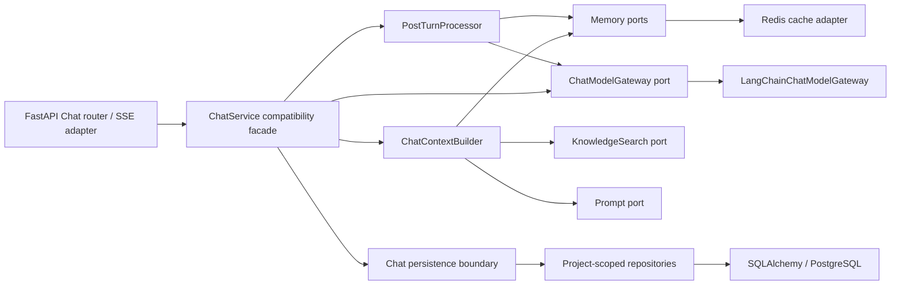

# S2：Graph 前分层重构

> **状态：FUTURE LOCKED。**
>
> 本阶段是一次严格的行为保持型重构：把 Chat 的数据库访问、上下文拼装、模型调用和 turn 后处理拆成可注入边界，为 S3 的确定性 Graph 节点提供稳定接口。S2 不安装 LangGraph，不增加工具，不改变任何公共行为。
>
> 当前唯一实施路线是 [`current-release/`](../current-release/README.md) 的 C1 → C2 → C3。S2 只有在 C1/C2/C3 与 S1 的 `evidence/<stage>/manifest.json` 均经 validator 通过、C3 已冻结当前版本、且用户在 C3 之后明确授权 Agent 路线时才可解锁。文档存在或允许评审不等于允许实施。
>
> 本文的路径与耦合证据来自 2026-07-29 的 pre-C1 快照。解锁后必须以 C3 freeze commit、S1 完成 commit 和当时的 OpenAPI/Alembic head 重做基线；C1/C2 已冻结的 Chat 契约拥有权威性，不得按旧快照回退、重写或再次实现 typed SSE、summary watermark、post-turn、AIReadMe 等当前版本能力。
>
> S2 继续使用公共契约中的 `local-single-user` sentinel、loopback-only 部署和 header-only Project scope；分层重构不得伪造认证/RBAC，也不得开启远程访问。

---

## 实施入口 / 本阶段闭环

公共类型、事件、API、sentinel 和错误语义只以[公共契约](00-执行约定与公共契约.md)为准；本文只描述 S2 的行为保持型内部重构。

| 项目 | 唯一入口 |
|---|---|
| 前置 manifest | C1/C2/C3 + S1 manifest/validator、freeze/S1 commit、OpenAPI、Alembic head、S2 明确授权 |
| 唯一增量 | project-scoped repositories、`ChatContextBuilder`、model gateway、`PostTurnProcessor`、强制 `ChatUnitOfWork` |
| 必测 | C1/S1 golden parity；summary CAS watermark；PG commit/rollback；Redis post-commit；typed warning；architecture imports |
| 演示 | 同一 fixture 的 Prompt/SSE/DB/cache hash 在重构前后完全一致 |
| 回退 | 无 migration；仅在 detached 临时 worktree 反向应用 S2 patch，并用一次性 PG/Redis 重跑 C1/C2/S1 contracts |
| 下一步 | 只把 ports/value/UoW 交给 S3；不得安装 LangGraph、创建双业务实现或改变公共 wire contract |

## 1. 阶段目标与用户可见结果

用户可见结果应当是：**没有功能变化**。

重构前后，同一确定性输入必须得到：

- 相同 HTTP 路径、请求字段、响应包络和状态码；
- 相同 `X-Project-ID` 规则；
- 相同 SSE 事件名、payload、顺序、空白 delta 和 terminal 语义；
- 相同 Conversation/Message/summary/LongTermMemory 持久化结果；
- 相同 CHAT Prompt 文本；
- 相同 RAG/Memory 召回参数和项目隔离；
- 相同 post-turn trigger、warning 和 fatal/non-fatal 边界；
- 相同 DeepSeek/Ollama 配置、PromptTemplate 和前端行为。

内部结果是：

1. `ChatService` 不再直接 import SQLAlchemy、ORM model、Redis client 或原始 LangChain model。
2. 所有项目级持久化通过显式 scope repository/port。
3. 上下文拼装成为独立 `ChatContextBuilder`，输入/输出是可序列化值，并显式返回 C1/C2 已冻结的 typed degradation warnings。
4. Chat 文本/流式/事实抽取模型能力通过 `ChatModelGateway`。
5. summary + memory 后处理成为独立 `PostTurnProcessor`，返回 typed report，不自己发 SSE。
6. 强制 `ChatUnitOfWork` 固定 C1 的短 PG 事务所有权；transaction A、transaction B 与各 post-turn 写入分别显式创建，summary + watermark 原子推进，Redis 只能在对应 commit 后刷新。
7. FastAPI router/SSE 仅做传输适配；未来 Graph node 可以复用 builder/gateway/processor/UoW，而不接触 request、session 或连接对象。

## 2. 前置条件

- C1、C2、C3 evidence 均存在且 DoD 全通过，C3 明确“当前版本是否完成：是”。
- 用户在 C3 完成后明确授权实施 Agent 路线。
- S1 已完成且有：
  - `ProjectScope`；
  - 五张项目级表与双项目隔离证据；
  - C1 冻结的 typed Chat SSE、completed 前持久化和 post-turn 契约仍通过的回归结果。
- 完整阅读：
  - 根目录 `AGENTS.md`
  - current-release C1/C2/C3 文档与 evidence
  - 路线 README、公共契约、S1 阶段文档与 evidence
  - ADR-0001、0002、0003、0004、0005、0007
  - `docs/migration/testing-notes.md`
- 记录当前 `alembic heads`。S2 不得产生新 revision。
- 在修改生产代码前，先在 S1 代码上生成并提交/记录 §7 的行为基线 fixture 及 SHA256；重构后不得“顺手更新期望值”使测试变绿。

实施前命令：

```bash
repo_root="$(git rev-parse --show-toplevel)"
cd "$repo_root"
git status --short
(cd codeaware-py && uv run alembic heads)
(cd codeaware-py && uv run python scripts/run_tests_safe.py -q)
(cd codeaware-py && uv run python scripts/run_tests_safe.py --cov=app --cov-report=term-missing -q)
(cd codeaware-py/frontend && npm run test)
(cd codeaware-py/frontend && npm run lint)
(cd codeaware-py/frontend && npm run build)
```

## 3. 历史耦合证据（pre-C1，必须复核）

下表不是 S2 的实现清单。凡 C1/C2 已经拆除或修正的项，只记录实际新位置并建立 parity，不得恢复旧方法后再“重构”一次。

| 位置 | 当前职责混合 | S2 目标 |
|---|---|---|
| `app/ai/services/chat.py::ChatService` | 会话创建、SQL、消息、上下文、模型流、SSE、commit、post-turn、删除/列表 | 只保留兼容 facade/turn 编排，不直接碰实现型 client/model |
| `ChatService._build_context_prompt()` | LTM、RAG、短期记忆、Prompt fallback 全在一个私有方法 | 移到独立 `ChatContextBuilder` |
| `ChatService._maybe_extract()` | 查询 Memory、调用模型、吞异常 | 移到 typed `PostTurnProcessor` |
| `app/ai/memory/short_term.py` | Redis、Message SQL、Conversation summary SQL、trigger 混在一起 | SQL 经 repository，Redis 仍是 adapter；trigger policy 可单测 |
| `app/ai/memory/long_term.py` | SQL、VectorRecall、structured model/fallback | persistence 和 model boundary 分开 |
| `app/ai/services/rag.py` | Document persistence、chunk/vector、query rewrite/retrieve | 对 Chat 暴露项目化 Knowledge port，不泄漏 ORM |
| `app/api/v1/deps.py::get_chat_service` | 直接拼出一棵持有同一 `AsyncSession` 的具体对象图 | 只作为 composition root |
| `app/repositories/base.py` | 只有无 scope 的通用 get/list/add/delete | 项目实体不能依赖无过滤 get/list |
| `app/ai/config.py` | 直接暴露 `ChatOpenAI` | Chat 核心路径由 gateway 包装；配置工厂保持不变 |

当前已有功能不是本阶段要“修正”的对象。若发现额外 bug：

1. 写成测试和已知问题；
2. 除非它阻止本阶段行为保持，否则不在 S2 修复；
3. 不得用“重构”掩盖 Prompt、排序、错误或 API 行为变化。

## 4. 范围

### 4.1 允许修改

- `app/ai/services/chat.py`（兼容 facade/turn orchestration）
- `app/ai/chat/` 下新增纯契约、context、gateway、post-turn 模块
- Chat 核心路径需要的 project-scoped repositories
- `ShortTermMemoryManager`、`LongTermMemoryManager`、`RagService` 的依赖形态
- `app/api/v1/deps.py` composition root
- 保持 C1/C2 冻结 wire contract 所需的 router/SSE adapter
- 只用于证明 parity/architecture 的测试与 fixture
- 类型注解、docstring 和直接相关架构说明

### 4.2 明确不做

- 不增加 `langgraph` 依赖、import、StateGraph、node、edge、checkpoint。
- 不增加 Agent/Tool/Run/Step/Citation/Artifact/Approval。
- 不增加数据库表、列或 Alembic revision。
- 不增加 public API、请求字段、响应字段、事件名或 feature flag。
- 不改变 `service|graph` 路径；该双路径从 S3 才出现。
- 不改变 Project header、隔离谓词或默认 Project。
- 不改变 CHAT Prompt 字符、RAG top_k、threshold、query rewrite、RRF 或 memory policy。
- 不改变 DeepSeek model、thinking 模式、temperature、timeout、fallback。
- 不把 Code Review、Unit Test、AI ReadMe 全面重写成新架构；它们只需回归通过。
- 不引入消息队列、后台 worker、OpenTelemetry、Phoenix 或持久化 event。
- 不让“内部更整洁”成为删除异常路径测试的理由。

## 5. 目标依赖方向



依赖规则：

- 左侧 application code 只认识 Protocol/dataclass/Pydantic value。
- SQLAlchemy model、`AsyncSession` 只能出现在 repository/infra/composition root。
- Redis client 只能出现在 short-term cache adapter/composition root。
- `ChatOpenAI` 只能出现在 LangChain gateway/config/composition root。
- builder、processor 和未来 node 不得 import FastAPI、StreamingResponse 或 SSE encoder。
- 所有 port 方法显式接收 `ProjectScope`，不提供“缺省为全库”重载。

## 6. 建议目录与稳定内部类型

建议新增：

```text
codeaware-py/app/ai/chat/
├── __init__.py
├── contracts.py
├── ports.py
├── context_builder.py
├── model_gateway.py
└── post_turn.py

codeaware-py/app/repositories/
├── conversation.py
├── message.py
├── long_term_memory.py
└── document.py
```

名字可按现有风格微调，但职责和依赖约束不得合并回巨型 service。

### 6.1 `contracts.py`

只包含可序列化值，不含 ORM/client/session：

```python
@dataclass(frozen=True, slots=True)
class ConversationData:
    id: int
    conversation_id: str
    project_id: UUID
    title: str | None
    summary: str | None
    summary_message_count: int


@dataclass(frozen=True, slots=True)
class MessageData:
    role: str
    content: str


@dataclass(frozen=True, slots=True)
class RecalledMemory:
    content: str
    score: float


@dataclass(frozen=True, slots=True)
class KnowledgeContextItem:
    chunk_content: str
    score: float
    match_type: str


@dataclass(frozen=True, slots=True)
class ChatContext:
    prompt: str
    long_term_text: str
    rag_text: str
    conversation_history: str


@dataclass(frozen=True, slots=True)
class ChatWarning:
    stage: str
    code: str
    message: str


@dataclass(frozen=True, slots=True)
class ChatContextResult:
    context: ChatContext
    warnings: tuple[ChatWarning, ...] = ()


@dataclass(frozen=True, slots=True)
class ModelDelta:
    delta: str
    usage: ChatUsage | None = None


@dataclass(frozen=True, slots=True)
class ModelReply:
    text: str
    usage: ChatUsage


@dataclass(frozen=True, slots=True)
class PostCommitCacheAction:
    kind: Literal["refresh_messages", "refresh_summary", "delete_conversation"]
    conversation_id: str


@dataclass(frozen=True, slots=True)
class PostTurnReport:
    warnings: tuple[ChatWarning, ...] = ()
    cache_actions: tuple[PostCommitCacheAction, ...] = ()
```

字段必须复用 C1 冻结的 Chat event schemas，不能定义第二套冲突的 SSE/public event 类型。`ChatWarning.stage=context` 映射为 `context.warning`，post-turn/cache 映射为 `post_turn.warning`；两类降级都不得静默丢失。内部对象保存字符串、数字、UUID 和 tuple/list；不保存大型 ORM graph、连接或 model response。

### 6.2 `ports.py`

用 `typing.Protocol` 定义调用方需要的最小行为。至少：

```python
class ConversationRepositoryPort(Protocol):
    async def create(self, scope: ProjectScope, cid: str, title: str) -> ConversationData: ...
    async def require(self, scope: ProjectScope, cid: str) -> ConversationData: ...
    async def list(self, scope: ProjectScope) -> Sequence[ConversationData]: ...
    async def delete(self, scope: ProjectScope, cid: str) -> bool: ...
    async def get_summary_state(self, scope: ProjectScope, cid: str) -> ConversationData: ...
    async def advance_summary(
        self,
        scope: ProjectScope,
        cid: str,
        *,
        expected_summary_message_count: int,
        new_summary: str,
        new_summary_message_count: int,
    ) -> bool: ...


class MessageRepositoryPort(Protocol):
    async def append(self, scope: ProjectScope, cid: str, role: str, content: str) -> None: ...
    async def recent(self, scope: ProjectScope, cid: str, limit: int) -> Sequence[MessageData]: ...
    async def count(self, scope: ProjectScope, cid: str) -> int: ...


class ChatModelGateway(Protocol):
    async def complete(self, prompt: str) -> ModelReply: ...
    def stream(self, prompt: str) -> AsyncIterator[ModelDelta]: ...
    async def extract_facts(self, prompt: str) -> list[str]: ...


class ChatUnitOfWork(Protocol):
    conversations: ConversationRepositoryPort
    messages: MessageRepositoryPort

    async def __aenter__(self) -> "ChatUnitOfWork": ...
    async def __aexit__(self, exc_type, exc, tb) -> None: ...
    async def commit(self) -> None: ...
    async def rollback(self) -> None: ...
    def defer_cache(self, action: PostCommitCacheAction) -> None: ...
```

另定义 ContextBuilder 所需的最窄 Memory/Knowledge/Prompt port。不要让一个 port 暴露 SQLAlchemy `select()`、session 或通用 `execute()`。

`ChatUnitOfWork` 是强制边界，不是“如果实现需要”的可选抽象。它表示一个**短 PG transaction**，不是整个模型 turn 的长事务：C1 transaction A（Conversation + USER）、transaction B（ASSISTANT）和每个 post-turn 写入分别创建/提交 UoW，模型/embedding/LLM 等外部等待期间没有打开的数据库 transaction。`advance_summary()` 用 expected watermark 做行锁或条件更新，成功时原子写 `summary + summary_message_count`。每个 UoW 只登记属于本次 commit 的 cache action，PG `commit()` 成功后由 coordinator 执行 Redis 更新；commit 失败时不得触碰 Redis。流式入口必须在 generator/runtime 自己的生命周期内创建这些 UoW，不能依赖 `StreamingResponse` 结束后的 request dependency teardown。

## 7. 先建立不可变的行为基线

在重构前，用现有 S1 路径和确定性 fake 建议生成：

```text
codeaware-py/tests/fixtures/s2/chat_prompt.txt
codeaware-py/tests/fixtures/s2/chat_stream_events.json
codeaware-py/tests/fixtures/s2/chat_http_contract.json
codeaware-py/tests/fixtures/s2/post_turn_cases.json
```

fixture 内容：

1. 同一项目中固定 LTM、Knowledge、历史、用户消息拼出的完整 Prompt，逐字保存。
2. 新会话成功流的 typed event 序列和 payload shape；动态 cid 用占位符规范化。
3. 同步 `/send`、list/get/delete 的 status/envelope/schema。
4. summary success/failure、memory success/failure、fatal model/persistence 的 terminal/warning 序列。
5. 两项目同 marker 时，Prompt 只含当前项目内容。

生成规则：

- 只用 fake LLM/embedder/Redis/测试 PG；
- 对动态 UUID、时间做显式 normalize，不能删除业务字段；
- 在重构前记录每个 fixture 的 SHA256；
- 重构后测试读取固定 fixture；
- 若确实发现基线本身违反 C1/C2 或 S1 契约，停止 S2，回到权威阶段单独报告，不得同时改变 fixture 和实现。

可执行：

```bash
repo_root="$(git rev-parse --show-toplevel)"
cd "$repo_root"
shasum -a 256 codeaware-py/tests/fixtures/s2/*
```

证据中保存重构前、后的相同 hash。

## 8. 详细实施步骤

### 步骤 1：新增 projection 和 repository

先把 `ChatService` 当前直接 SQL 移到 scope repository：

- `ConversationRepository`
  - create/require/list/delete；
  - summary get/update；
  - 每个查询都带 `Conversation.project_id == scope.project_id`。
- `MessageRepository`
  - append/recent/count；
  - 每个方法必须通过父 Conversation 验证 scope，不能因为 cid 当前全局唯一就省略。
- `LongTermMemoryRepository`
  - has-for-conversation、store、recall；
  - 保持 VectorRecallService 和 S1 filter，不改变排序/threshold。
- `DocumentRepository`/Knowledge adapter
  - 保持父子聚合和项目过滤；
  - 只暴露 ContextBuilder 需要的 `search()` projection。

repository 返回 projection/value，不把 ORM 实例交给 ChatService/builder/processor。保留通用 `Repository` 给确实无 scope 的简单场景，但项目级 Chat 路径不得调用其无过滤 `get/list`。

先运行 repository/隔离测试，结果必须与 S1 相同。

### 步骤 2：让 ShortTermMemory 依赖 repository

`ShortTermMemoryManager` 保留“PG 真相 + Redis 缓存”职责，但：

- 不 import `Conversation`、`Message` 或 SQLAlchemy statement；
- PG append/recent/count/summary 走 repository ports；
- 所有 public 方法显式接收 `ProjectScope`；
- Redis key 和 TTL 保持 S1 语义；
- Redis miss 的 PG fallback、顺序、窗口大小逐字相同；
- summary trigger policy 抽成纯函数或独立小类，输入 `message_count/summary_message_count/threshold/interval`，输出 bool；
- summary 成功通过 `advance_summary()` 原子推进文本和 watermark；并发条件失败时重新读取，不允许旧摘要覆盖新摘要；
- 不改变 summary prompt 文本。

### 步骤 3：建立 `ChatContextBuilder`

从 `_build_context_prompt()` 原样迁移。固定执行顺序：

1. `long_term.recall(scope, message, threshold=0.0, top_k=5)`；
2. `knowledge.search(scope, message, top_k=5)`；
3. `short_term.get_context_window(scope, cid)`；
4. `prompt.get_active(CHAT)`；
5. 用原占位符和原格式渲染。

行为保持要求：

- LTM/RAG 失败按 C1/C2 冻结语义降级为空上下文，并返回 typed `ChatWarning`；facade 使用 C1 的公共 warning 事件，不得静默吞掉，也不得新造事件名；
- fallback Prompt 的每个换行和标题保持；
- `（无）`、`（新对话）` 文本保持；
- 当前 USER 消息在历史/占位符中的既有出现方式保持，不借重构去重；
- `ChatContext.prompt` 与基线 fixture byte-for-byte 相同；
- builder 不调用模型、不持久化、不发 SSE。

### 步骤 4：建立 LangChain model gateway

`app/ai/chat/model_gateway.py` 的 concrete adapter 包装 `get_chat_model()` 返回的现有对象：

- `complete()` 调用原 `ainvoke()` 并按 C1 冻结规则提取 text/usage；
- `stream()` 调用原 `astream()`，只跳过真正的空字符串，保留空白 delta；
- `extract_facts()` 封装现有 `with_structured_output(ExtractedFacts, method="json_mode")` 和同样的 `ainvoke + _extract_json` fallback；
- 原 exception 向 application 层传播，由 C1 既有错误映射处理；
- 不新增 retry、不改变 timeout、不切换 thinking/tool calling；
- 不在 gateway 生成 SSE frame。

`app/ai/config.py` 的模型参数不变。Code Review/Unit Test/AI ReadMe 的结构化输出路径暂不迁移，避免把行为保持型 Chat 重构扩大成全产品模型重写。

### 步骤 5：建立 `PostTurnProcessor`

从 C1 冻结的 shared post-turn 原样迁移：

```python
async def process(
    scope: ProjectScope,
    conversation_id: str,
) -> PostTurnReport:
    ...
```

要求：

- 顺序仍为 summary 后 memory；
- summary 与 memory policy/阈值保持；
- summary 使用 gateway.complete，memory 使用 gateway.extract_facts；
- summary/memory 的外部模型计算不持有 transaction；每个领域写入使用 C1 冻结的显式短 UoW，保持 PG 真相和 non-fatal 语义；
- summary 使用 compare-and-set watermark；Redis refresh 只登记为 post-commit action；
- 返回 warnings，不 yield SSE、不依赖 FastAPI；
- warning stage/code/message/order 与 C1/C2 contract fixture 相同；
- `CancelledError` 不转 warning；
- processor 输入/输出不含 session、Redis/model client 或 ORM。

### 步骤 6：收窄 `ChatService`

保留类名和 `get_chat_service` 供 API/测试兼容，但 constructor 改为依赖 ports：

```text
Conversation repository
ShortTermMemory port
ChatContextBuilder
ChatModelGateway
PostTurnProcessor
ChatUnitOfWork（强制）
```

职责只剩：

1. 确定/验证 cid；
2. 编排 USER 保存 → context → model → ASSISTANT 保存；
3. 使用强制 UoW factory 保持 C1 transaction A/B 与 post-turn 各短事务的 commit/rollback 边界；
4. 调 PostTurnProcessor；
5. PG commit 成功后执行 deferred Redis actions，失败转 typed warning；
6. 把 context/post-turn/cache warning 映射为既有 C1 event schema，再发唯一 terminal event。

list/get/delete 也委托 repository/short-term port。类中不得出现：

- `select`, `delete`, `func`
- `AsyncSession`
- `Conversation`, `Message`, `LongTermMemory` ORM
- `ChatOpenAI`
- Redis client

同步和流式可以共享 preparation/persistence/post-turn helper，但不要为了代码复用而把流式响应缓冲到最后。

唯一 turn 时序必须是：

```text
transaction A UoW: validate/create Conversation + persist USER + commit
→ USER Redis refresh（post-commit）
→ chat.started
→ build context + context.warning*
→ stream/invoke model
→ transaction B UoW: persist complete ASSISTANT + commit
→ ASSISTANT Redis refresh（post-commit）
→ bounded post-turn model work（无打开 transaction）
→ summary/memory 各自短 UoW；summary CAS + watermark 原子 commit
→ corresponding Redis refresh（post-commit）
→ post_turn.warning*
→ chat.completed
```

任何 fatal error 都只 rollback 当前短 UoW，并映射为唯一 `chat.failed`；已经 commit 的 USER 按 C1 保留。commit 前不得运行对应 Redis action，所有 post-turn 均成功或转 warning 前不得发 completed。

### 步骤 7：composition root

`app/api/v1/deps.py::get_chat_service`：

- 构建 `ChatUnitOfWorkFactory`、Redis adapter、RAG/Prompt adapter、LangChain gateway、builder、processor、facade；
- 每个同步 turn 或流式 generator 持有一个 `ChatUnitOfWorkFactory`，并为 transaction A、transaction B、每个 post-turn 写入分别创建短 UoW；不得缓存 request session，也不得让 stream 依赖请求 teardown 才 commit；
- 不包含业务 if/threshold/filter；
- S1 的 `ProjectScope` 仍由 router/dependency 提供，而不是在 concrete repository 中从全局读取；
- 测试可逐个替换 port，不需要构造真实 DeepSeek/Ollama。

### 步骤 8：删除旧重复逻辑

完成 parity 后：

- 删除 `ChatService._build_context_prompt()` 的旧实现；
- 删除 `_maybe_extract()` 和第二套 summary/memory trigger；
- 删除 Chat 路径中的直接 SQL/model 调用；
- 不保留 `legacy/new` 双路径或永久 feature flag；
- `rg` 和 architecture test 必须证明没有重复实现。

## 9. 公共行为冻结矩阵

| 类别 | S2 必须保持 |
|---|---|
| HTTP | S1 的所有路径、method、status、Result envelope、Project header |
| SSE | `chat.started` → delta* → warning* → completed，或 failed；payload 字段不变 |
| 空白 | delta 和 PG ASSISTANT 逐字一致 |
| DB | 无 migration；表、列、FK、索引均不变 |
| Transaction | C1 transaction A/B、各 post-turn 短 UoW、无外部等待持有 transaction、commit/rollback 和 terminal 时序不变 |
| Cache | Redis key、TTL、window、miss fallback 不变；只在 PG commit 后刷新 |
| Context | LTM/RAG/history 顺序、top_k、threshold、format、Prompt 字节不变 |
| Model | model/base_url/temperature/max_tokens/timeout/structured fallback 不变 |
| Post-turn | trigger、summary CAS watermark、执行顺序、typed warning、fatal 边界不变 |
| Isolation | 所有 port 强制 ProjectScope；两条检索腿过滤不变 |
| Frontend | selector、页面、展示和请求行为不变；原则上无需业务代码修改 |
| 薄工具 | CR/UT/AI ReadMe/Prompt 行为和测试不变 |

如果任何一项需要变化，这不是 S2，应停止并拆成独立修复阶段。

## 10. 测试与验证

### 10.1 architecture tests

建议新增 `tests/test_s2_architecture.py`，用 AST/import 检查而非脆弱的纯文本误报：

- `app/ai/services/chat.py` 不 import sqlalchemy/app.models/AsyncSession/redis/langchain；
- `app/ai/chat/context_builder.py` 和 `post_turn.py` 不 import FastAPI/SQLAlchemy/Redis/LangChain；
- `contracts.py` 的字段不接受 ORM/session/client；
- project-scoped repository public 方法首要参数含 scope；
- Chat facade/runtime 必须依赖 `ChatUnitOfWorkFactory`，不能以可选 transaction 或 request teardown 代替；
- production code 无 `langgraph` import；
- 只有一个 context builder 和一个 post-turn trigger 实现。

辅助人工命令：

```bash
repo_root="$(git rev-parse --show-toplevel)"
cd "$repo_root"
rg -n \
  'sqlalchemy|AsyncSession|from app\.models|redis\.asyncio|langchain' \
  codeaware-py/app/ai/services/chat.py \
  codeaware-py/app/ai/chat/context_builder.py \
  codeaware-py/app/ai/chat/post_turn.py

rg -n 'langgraph|StateGraph|ToolNode' codeaware-py/app codeaware-py/pyproject.toml codeaware-py/uv.lock
```

两个命令都应无输出；自动验收以 AST test 为准。

### 10.2 unit/contract parity

建议新增：

- `tests/test_chat_context_builder.py`
- `tests/test_chat_model_gateway.py`
- `tests/test_post_turn.py`
- `tests/test_s2_parity.py`
- `tests/test_s2_architecture.py`

运行：

```bash
(cd codeaware-py && uv run python scripts/run_tests_safe.py \
  tests/test_chat_context_builder.py \
  tests/test_chat_model_gateway.py \
  tests/test_post_turn.py \
  tests/test_s2_parity.py \
  tests/test_s2_architecture.py \
  -q)
```

必须覆盖：

- Prompt fixture 逐字相等；
- gateway 保留纯空白 delta、usage 和异常；
- context LTM/RAG 单独失败时仍按基线降级；
- context LTM/RAG 失败返回并发出 C1/C2 typed warning，不静默吞掉；
- summary/memory 的 success/failure 组合及 warning 顺序；
- summary watermark compare-and-set 成功、并发冲突重读和同计数不重复生成；
- PG commit 成功前 Redis 零调用；commit 成功后 cache failure 只产生 warning；
- PG commit/rollback/Redis/terminal 的严格调用顺序；
- ASSISTANT commit fatal；
- typed SSE fixture 相等；
- 同步 response fixture 相等；
- 两项目 context 隔离相等；
- Redis miss、Conversation list/get/delete 相等；
- repository 不泄漏 ORM；
- fake port 单测不需要真实 DB/Redis/model。

### 10.3 原有重点回归

```bash
(cd codeaware-py && uv run python scripts/run_tests_safe.py -q \
  tests/test_chat.py \
  tests/test_short_term.py \
  tests/test_long_term.py \
  tests/test_rag.py \
  tests/test_api.py \
  tests/test_project_scope.py \
  tests/test_project_isolation.py \
  tests/e2e_smoke.py)
```

文件名以 S1 实际交付为准，不存在时不得用命令失败代替测试。

### 10.4 migration/前端/全量

```bash
(cd codeaware-py && uv run alembic heads)
(cd codeaware-py && uv run python scripts/run_tests_safe.py tests/test_migration.py -q)
(cd codeaware-py && uv run python scripts/run_tests_safe.py -q)
(cd codeaware-py && uv run python scripts/run_tests_safe.py --cov=app --cov-report=term-missing -q)
(cd codeaware-py/frontend && npm run test)
(cd codeaware-py/frontend && npm run lint)
(cd codeaware-py/frontend && npm run build)
```

`alembic heads` 必须仍只有 S1 的 revision；S2 不得新增 migration。

## 11. 可复制的行为等价演示

S2 没有新的 UI 功能，因此演示重点是“相同契约 + 新边界”。以下命令不需要真实 DeepSeek/Ollama：

```bash
set -euo pipefail

repo_root="$(git rev-parse --show-toplevel)"
cd "$repo_root"

(cd codeaware-py && uv run python scripts/run_tests_safe.py \
  tests/test_s2_parity.py \
  tests/test_chat_context_builder.py \
  tests/test_post_turn.py \
  -q)

shasum -a 256 codeaware-py/tests/fixtures/s2/*

(cd codeaware-py && uv run python scripts/run_tests_safe.py tests/test_s2_architecture.py -q)

test -z "$(
  rg -n \
    'sqlalchemy|AsyncSession|from app\.models|redis\.asyncio|langchain' \
    codeaware-py/app/ai/services/chat.py \
    codeaware-py/app/ai/chat/context_builder.py \
    codeaware-py/app/ai/chat/post_turn.py \
    || true
)"

test -z "$(rg -n 'langgraph|StateGraph|ToolNode' codeaware-py/app codeaware-py/pyproject.toml codeaware-py/uv.lock || true)"

(cd codeaware-py && uv run alembic heads)
```

所有后端测试均由 safe runner 创建/校验本次一次性 PG/Redis；禁止裸跑 pytest。命令清单从仓库根开始，子目录只在单个 subshell 内进入。

期望：

- parity/context/post-turn 全通过；
- fixture hash 与重构前证据完全一致；
- architecture test 通过；
- 两次 `rg` 断言通过；
- Alembic head 未变化。

如需用户可见 smoke，沿用 C1/S1 的 curl：

```bash
api_base="http://localhost:8000"
project_id="00000000-0000-0000-0000-000000000001"

curl -NsS \
  -H 'Content-Type: application/json' \
  -H "X-Project-ID: ${project_id}" \
  -d '{"message":"S2 behavior parity smoke"}' \
  "${api_base}/api/chat/send/stream"
```

原始输出应仍只有 C1 定义的 typed Chat 事件，不得出现 node、graph、tool 或 run 事件。

## 12. Definition of Done

- [ ] S1 行为 fixture 在重构前生成，重构后 hash 未变化
- [ ] `ChatService` 无 SQLAlchemy/ORM/Redis/raw LangChain import
- [ ] project-scoped repositories 强制 `ProjectScope` 且不泄漏 ORM
- [ ] `ChatContextBuilder` 独立、纯输入输出、Prompt byte parity
- [ ] `ChatModelGateway` 保留 text/stream/usage/fact extraction 行为
- [ ] `PostTurnProcessor` 保留 trigger、事务、warning 与顺序
- [ ] `ChatUnitOfWork` 强制存在，summary + watermark 原子推进，Redis 只在 PG commit 后执行
- [ ] Context/Post-turn/cache 降级都返回 typed warning，未新增或吞掉公共事件
- [ ] 同步/流式 Chat 共用核心边界，仍实时流式
- [ ] C1/C2 Chat 契约和 S1 项目隔离契约完全不变
- [ ] 数据库 schema/Alembic head 不变
- [ ] Redis key/TTL/fallback 不变
- [ ] CR/UT/AI ReadMe/Prompt 等其他功能全量回归
- [ ] architecture/parity/异常/隔离测试通过
- [ ] 后端全量/覆盖率和前端 test/lint/build 通过
- [ ] 依赖和源码中没有 LangGraph、Tool、Agent、Run
- [ ] 没有 legacy/new 双实现和永久 flag
- [ ] 回退演练完成
- [ ] 本阶段实现/验收位于记录 base commit 的 detached 临时 worktree，用户当前工作树未变化
- [ ] safe runner 精确清理本次一次性 PG/Redis，stack identity/cleanup report 已进入 manifest
- [ ] `evidence/S2/manifest.json`、`report.md` 和哈希引用产物完整，validator 通过后才可把阶段状态改为“已完成”

## 13. 回退

S2 无 migration、无公共契约变化。代码回退只在从记录 base commit 建立的 detached 临时 worktree 中验证，并使用 safe runner 的另一套一次性 PG/Redis：

```bash
repo_root="$(git rev-parse --show-toplevel)"
cd "$repo_root"
test "$(git rev-parse --is-inside-work-tree)" = "true"
# 按受控脚本创建/校验 detached 临时 worktree 后，仅在其中验证反向补丁。
(cd codeaware-py && uv sync)
(cd codeaware-py && uv run python scripts/run_tests_safe.py -q)
(cd codeaware-py/frontend && npm ci)
(cd codeaware-py/frontend && npm run test)
(cd codeaware-py/frontend && npm run lint)
(cd codeaware-py/frontend && npm run build)
```

回退原则：

- 不执行 Alembic downgrade；S2 没有 revision。
- 不清理数据库或 Redis；行为保持型重构不应要求数据回退。
- 不保留运行时 feature flag 在新旧 ChatService 之间切换。
- 临时 worktree 中应用反向补丁后，重新运行 S1 双项目隔离和 C1/C2 Chat 契约测试。
- 禁止在用户当前工作树执行 `git revert`、`checkout/reset/clean`；临时 worktree 和一次性 stack 只按精确 identity 清理。

如果 revert 后才恢复功能，说明 parity 测试有遗漏；S2 状态必须保持“未完成”，补齐失败场景后重新实施。

## 14. 验收证据交接

复制模板为：

```text
docs/roadmap/chat-to-agent/evidence/S2/manifest.json
```

同时生成 manifest 引用的 `report.md`/artifacts，并从仓库根运行 `(cd codeaware-py && uv run python scripts/validate_stage_evidence.py S2)`；旧式单文件 evidence、Markdown 勾选或未被 manifest 引用的文件不能解锁 S3。证据必须包含：

- 起止 commit、branch 和 S1 Alembic head；
- 重构前/后 fixture 路径与 SHA256；
- 依赖方向或模块清单；
- architecture test 和两条 `rg` 的输出；
- Prompt byte parity、SSE parity、HTTP parity；
- summary/memory success/failure/fatal 组合测试；
- summary watermark CAS、commit/rollback 和 Redis post-commit 顺序测试；
- 双项目 context/CRUD 回归；
- 全量 pytest/coverage、前端 test/lint/build；
- `uv.lock`/`package-lock.json` 中无 LangGraph 依赖的核验；
- 回退后 C1/C2/S1 契约仍通过的结果；
- 明确声明“本阶段没有新增用户功能、public API、migration、Graph 或 Tool”。

S3 只可消费这些 ports/value types，不得重新把 session、ORM、Redis 或 model client 放进 Graph State/node。
